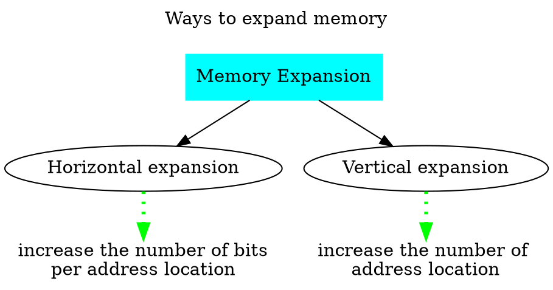
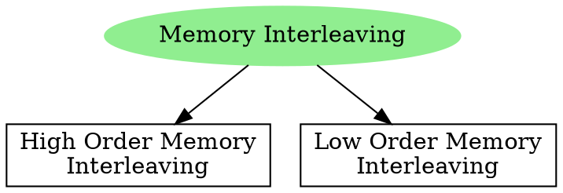

# Memory Organization

- Every memory chip has 3 active-low inputs 
	1. Chip Select
	2. Read-Enable or Output-Enable
	3. Write-Enable
- These inputs are *control lines* connected to the memory chip.

> [!NOTE] 
> Questions such as CS, RE, WE as active-high inputs can be asked in GATE.
# Memory Expansion

- Larger memories can be built by expansion.
	- Horizontal expansion to increase the word size.
	- Vertical expansion to increase the number of words.

## Horizontal Memory Expansion

## Vertical Memory Expansion

- **Memory Interleaving** is used to increase the number of address locations.

### High Order Memory Interleaving
- In high order memory interleaving, within a memory module (memory chip), the addresses are consecutive.
- A chip is selected and a address is located in that memory chip.

### Low Order Memory Interleaving
- In low order memory interleaving, across the memory modules (memory chip), the addresses are consecutive.

> [!timer] 01:30:29

