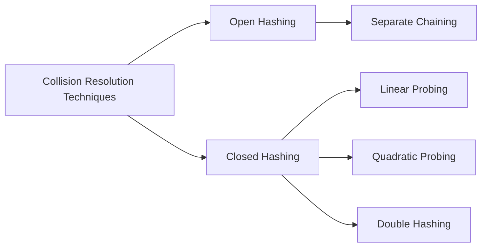

# Collision Resolution
> [!lecture] Lecture-20c

- Collision is when more than one keys map to the same location.



> [!NOTE] 
> - Open Hashing is also called as Closed Addressing
> - Closed Hashing is also called as Open Addressing
>> [!link] [hash - Meaning of Open hashing and Closed hashing - Stack Overflow](https://stackoverflow.com/questions/9124331/meaning-of-open-hashing-and-closed-hashing)


## Separate Chaining
- All keys that map to the same hash value are kept in a list.

> [!lecture] Lecture-20d

### Unsuccessful Search
> [!definition] Theorem


### Successful Search

- To search an item, it must be there in the hash table i.e. inserted into the hash table.
- To insert an item `i`, it takes an unsuccessful search. 
- Now it is guaranteed that an item `i` is there is the hash table, what is the time taken for successful search.

````col
```col-md
flexGrow=1
===
Successfully search for ith item with $n$ items in the table
```

```col-md
flexGrow=0.3
===
$\equiv$
```

```col-md
flexGrow=1
===
Inserting $i^{th}$ item with $(i - 1)$ items in the table
```

```col-md
flexGrow=0.3
===
$\equiv$
```

```col-md
flexGrow=1
===
Unsuccessfully search for $i^{th}$ item with $(i - 1)$ items in the table
```
````


## Open Addressing
> [!lecture] Lecture-21a

- There is no chain.
- All the elements are stored in the hash table i.e. ${} n \le m {}$ 
- When there is a collision, find another free bucket through probing

### Idea behind Probing

- There are three probing strategies,
	1. Linear Probing
	2. Quadratic Probing
	3. Double Hashing

