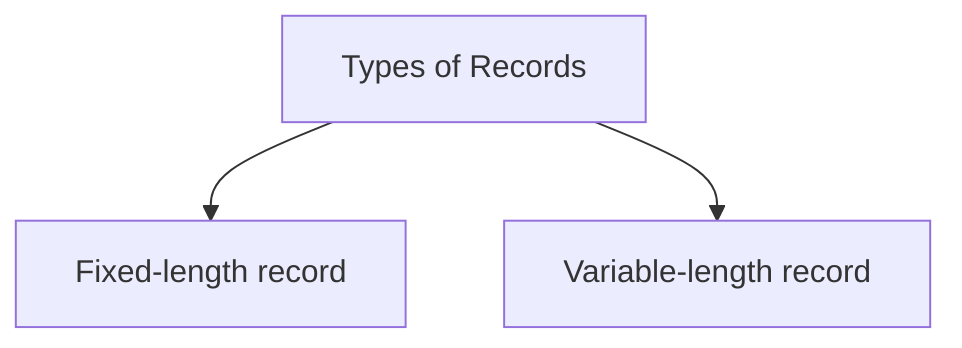

# File Organization
> [!lecture] Lecture-1

- How the database is stored in the [[Disk Structure and Performance|Disk]].
- Each table/relation is stored as a separate file on the disk.
- A file is a sequence of consecutive blocks.
- Databases are stored physically as files of records, which are typically stored on magnetic disks.
- A database is mapped into a number of different files.
- A file is organized logically as a sequence of records. These records are mapped onto disk blocks.

## Blocks vs Sectors
- Block size cannot exceed the size of a track.
- A block can contain several record.
- No record is larger than a block.

## Types of Records
- A record is a tuple in a relation.
- If every record in a file has exactly same size (in bytes), then the file is said to be made up of fixed-length records.
- If every record in a file has exactly different sizes (in bytes), then the file is said to be made up of variable-length records.



- Every record has some space for its meta-data called Record Header.

````col
```col-md
flexGrow=1
===
### Record Header
```
```col-md
flexGrow=1
===
### Block Header
```
````

### Find a field in fixed-length record

### Find a field in variable-length record
- Create pointers consecutively for each field after the Record header and a pointer for the end of the record.

## Record Organization

````col
```col-md
flexGrow=0.9
===
### Spanned Organization
- Records are allowed to cross block boundaries
- Used for fixed-length and variable-length records
```
```col-md
flexGrow=1
===
### Unspanned Organization
- Records are NOT allowed to cross block boundaries
- Used for fixed-length records
```
````

- Unspanned organization is the default organization. It takes very less access time compared to spanned organization.

> [!NOTE] In case of variable-length records, average record size will be given.


> [!attention] 
> Average case is considered in DBMS, whereas Worst case is considered in Algorithms.

## Organisation of Records in Files

### Heap File Organization

### Sequential File Organization

- Binary search is done on blocks and not on records.
- Only one field can be used to order the records, and for effective binary search use the same field to search rather than any other field.

## Block and Sector Address


> [!lecture] Lecture-2
>> [!youtube] [Practice - Ullman, Navathe File Organization Questions - DBMS | GO Classes | Deepak Poonia - YouTube](https://www.youtube.com/watch?v=AqhR0P2fbDM)
