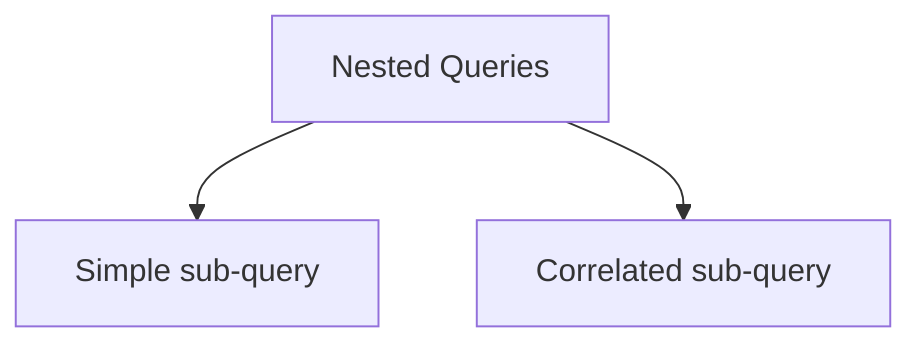

# Nested Queries
> [!lecture] Lecture-9

- Nested Queries in SQL are like function calls in [[C]].
- To nest a query for the `SELECT` clause, the result of the sub-query must be of a single tuple with a single column.
	- The sub-query's `SELECT` clause must use a single aggregate function without `GROUP BY`.

- If the sub-query does not use the attributes of outer query, then it is called a **simple sub-query**. It is independent from outer query.
	- A simple sub-query is computed once.
	- To conceptually understand, go from bottom up of the nesting.
- If the sub-query uses the attributes of outer query, then it is called a **correlated sub-query**. It is dependent on outer query.

## Simple Sub Query
- `IN`, `NOT IN`,  are the SQL keywords used for nested queries.

> [!intuition] Nested queries make writing SQL queries much more easier.

### IN in SQL
- SQL membership keywords - `IN`, `NOT IN`

If ${} S$ is a tuple and $R$ is a relation which is a result of a sub-query, then
1. ${} S$ `IN` $R$ is True iff tuple $S$ is in $R$
2. $S$ `NOT IN` $R$ is True iff tuple $S$ is not in $R {}$

## Correlated Sub Query
> [!lecture] Lecture-10
>> [!youtube] [Correlated Nested Queries in SQL | Nested Queries | DBMS | GO Classes | Deepak Poonia - YouTube](https://www.youtube.com/watch?v=JbFyb2X7OCY)

For every tuple of the outer query, the sub-query is computed every time.

### EXISTS in SQL
- existence of a tuple

If ${} q$ is a sub-query, then
1. `EXISTS` $q$ is True iff result of ${} q {}$ is not empty 
2. `NOT EXISTS` ${} q$ is True iff result of ${} q$ is empty  

![[Nested Queries in SQL-20231128175911500.webp]]

### UNIQUE in SQL

If $q {}$ is a sub-query, then
1. `UNIQUE q` is True iff result of ${} q {}$ has no duplicates.
2. `NOT UNIQUE q` is True iff result of $q$ has some duplicates.

### ALL, ANY, SOME in SQL

`SOME` ${} \equiv {}$ `ANY` in SQL.
`ALL` is equivalent to the ${} \forall {}$ quantifier.
`SOME`, `ANY` are equivalent to the ${} \exists {}$ quantifier.

`IN` ${} \equiv {}$ ` = ANY`
`NOT IN` ${} \equiv {}$ ` <> ALL`