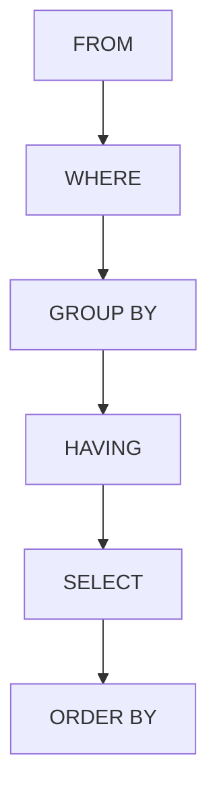
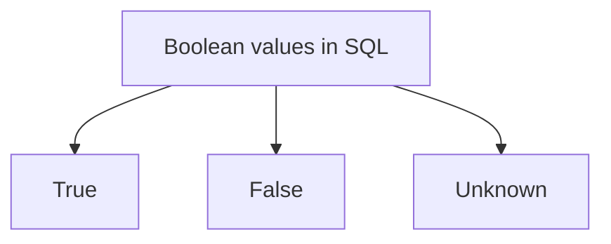

# SQL Queries
> [!lecture] Lecture-1, 2

- SQL keywords are case-insensitive, whereas the strings which are enclosed in single quotes (') are case sensitive.
## Basic form

- `SELECT`and `FROM` clauses are mandatory in all SQL queries, whereas `WHERE` is optional.

- When primary key attributes (columns) are selected from the cross product of two tables, then it is guaranteed to NOT contain duplicate rows.
- Once an alias for a table is declared in the query, then the original table name cannot be used in the query.
- `DISTINCT` works on the whole instance in the final output.
- `WHERE` clause checks only one tuple at a time independently.
- `SELECT` clause can use arithmetic expressions involving arithmetic operators such as ${} +, -, \ast, / {}$

## Conceptual Evaluation
- Order of conceptual evaluation of an SQL query
	1. Cross product (`FROM`)
	2. Discard the rows that fail predicate (`WHERE`)
	3. Discard unwanted columns (`SELECT`)

> [!conflict] 
> The conceptual evaluation is NOT followed by any DBMS software. And also SQL is declarative and NOT procedural.



^371647

## Range Variables
- When the same table is used more than once for a clause, then it is mandatory to use aliases which is called a range variable.
- It is also called as tuple variable.

## Boolean values in SQL
> [!lecture] Lecture-6


- `WHERE` clause passes only when a tuple turns out to be true and it fails when the tuple is either false or unknown.

![[SQL Queries-20231125221511859.webp]]

## UNION, EXCEPT and INTERSECT

> `UNION` - Set Union
> `EXCEPT` or `MINUS` - Set Difference
> `INTERSECT` - Set Intersection

- These three keywords are exactly same as [[Relational Algebra]].
- These operations can be performed only when the tables are [[Basic Operations in Relational Algebra#Union Compatible|Union compatible]].
- The result of these operations are a set of tuples and they do NOT contain duplicates.
- `UNION`, `EXCEPT` and `INTERSECT` operations first remove the duplicates from the input but only `UNION` needs to remove the duplicates from the output. The output of these operations are sets.

- `UNION ALL`, `EXCEPT ALL`, `INTERSECT ALL` are used to frequency-based operations. They result in a multi-set of tuples.

## AND, OR, NOT
- `AND` is trickier than `OR` if we use it on the same attribute.

> [!important] 
> - Getting wrong results are considered to be bigger issues in SQL.
> - The results contains duplicates or NOT depends on the requirement and is not a bigger issue in SQL.

## Aggregate Functions
> [!lecture] Lecture-5

- `MIN()`, `MAX()`, `SUM()`, `COUNT()`, `AVG()` are the only aggregate functions in SQL.
- Aggregate functions give a single tuple as the output.
- SQL does not allow the use of `DISTINCT` or an attribute as argument with `COUNT(*)`.
- `ALL` is redundant when used with the aggregate functions.
- Only `SUM()` and `AVG()` CANNOT be used on attributes with string domain.

## NULL values in SQL
> [!lecture] Lecture-6

- `NULL` cannot be used in a query as an operand in SQL. But `IS NULL` and `IS NOT NULL` can be used as an operand in SQL.
> [!important] `IS` and `IS NOT` is used only for comparison with `NULL`
- Aggregate operators will first remove `NULL` and then perform the aggregation operation.
- Only `COUNT(*)` will NOT ignore `NULL` entries.
- If ${} R$ is an empty table, then all of the aggregate functions except `COUNT` return `NULL`.

| `SUM(R)`   | `NULL` |
|:-----------|:-------|
| `MIN(R)`   | `NULL` |
| `MAX(R)`   | `NULL` |
| `AVG(R)`   | `NULL` |
| `COUNT(R)` |      $0$ |  

- Arithmetic operations with `NULL` will always result in `NULL`.
- Comparison with `NULL` is unknown.

## GROUP BY, HAVING
> [!lecture] Lecture-7

- `GROUP BY` and `HAVING` are used for aggregation.
- `GROUP BY` provides a group based imaginary partition of tuples, but it does NOT sort or rearrange the tuples in the original database.
- `HAVING` filters the groups.

> [!point] `WHERE` VS `HAVING`
>  - `WHERE` filters the tuples individually and independently
>  - `HAVING` filters the groups individually and independently

- `HAVING` is used when there is a need to filter the groups after creating the group.
- Aggregation in `SELECT` clause happens only within group when we have `GROUP BY` clause.
- `SELECT` in presence of `GROUP BY` clause must have the same unaggregated attributes as in `GROUP BY`.
```sql
SELECT A, B, SUM(A), AVG(C), MIN(D)
FROM R
GROUP BY A, B;
```

- If there is no `GROUP BY` clause then, the entire table is regarded as one single group.

> [!header] `GROUP BY` with multiple relations in `FROM` clause

- Unaggregated attributes of `HAVING` must be subset of the unaggregated attributes of `GROUP BY`. There can be any aggregated attributes for `HAVING`.


> [!think] 
> Think about the desired people and the additional people. Will the additional people affect out calculation?


## ORDER BY
- Sorts the output in a sorted order.
- `ASC` and `DESC` are used to sort the attributes.
- By default the ordering is `ASC`.

![[SQL Retrieval Queries#^371647]]

# Practice
> [!lecture] Lecture-8
>> [!youtube] [SQL Standard Practice Questions - DBMS | SQL Exercises | GO Classes | Deepak Poonia - YouTube](https://www.youtube.com/watch?v=5O9Hk46boGI)
