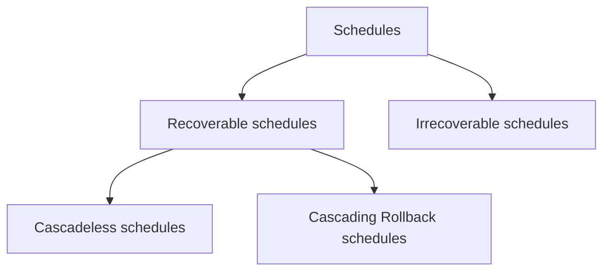

# Recoverability

>[!diagram] Classification of schedules based on Recoverability

```mermaid
flowchart TD 
	A[Schedules] --> B[Recoverable schedules]	
	A --> C[Irrecoverable schedules]
	B --> D[Cascadeless schedules]
	B --> E[Cascading Rollback schedules]
```

## Irrecoverable and Recoverable schedules