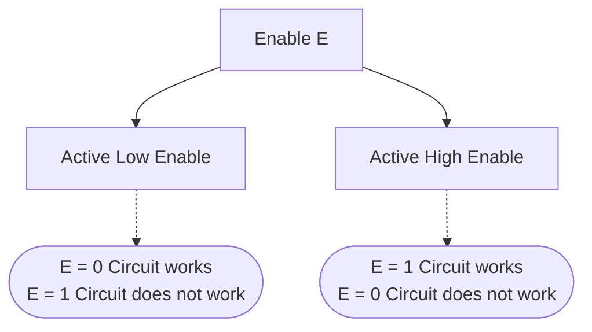

# Multiplexer

- Multiplexer (MUX) is a data selector which works like a **bridge**.
- Every MUX is a $2^n \times 1$ MUX, where $n$ is the number of select lines or control inputs and there are $2^n$ number of inputs.
- Every MUX has only one output line.

> [!question] 
> Why MUX has only one output line?
>> 

> [!important] 
>> Think of MUX as a bridge where inputs are waiting at each gates and the control inputs check the ID number for each gateway.
>
> ![[Multiplexer-20240303072621253.webp|$4 \times 1$ MUX]]
> 

|  ![[Multiplexer-20240303073303413.webp]]   |  ![[Multiplexer-20240303073355096.webp]]   |
| --- | --- |
|  ![[Multiplexer-20240303073425779.webp]]   |  ![[Multiplexer-20240303073450940.webp]]   |

## Realization of functions from MUX

![[Multiplexer-20240303075206381.webp]]

![[Multiplexer-20240303080640017.webp]]

- To implement a function of $n$ variables without using additional hardwares, a single $2^n \times 1$ MUX is used.

## Functions to MUX

> [!tip] 
> 1. Look at the function carefully and do not use additional variables which are not in the function.
> 2. If you are not getting any idea, then create the canonical SOP from the given function and copy the same to the circuit.

![[Multiplexer-20240303083438217.webp]]

![[Multiplexer-20240303083740711.webp]]

![[Multiplexer-20240303084158702.webp]]

![[Multiplexer-20240303084651501.webp]]

![[Multiplexer-20240303085009336.webp]]

![[Multiplexer-20240303085656863.webp]]

## Building Bigger MUX from Smaller MUX

## MUX with Enable Input
- Enable is like a switch to ON or OFF the MUX

# Demultiplexer
- A output line is selected for the incoming data in the DEMUX.
- DEMUX is more like which output receives the incoming data. The incoming data can be either 0 or 1.

> [!discussion] 
> ![[Multiplexer and Demultiplexer-20240303202450744.webp]]

