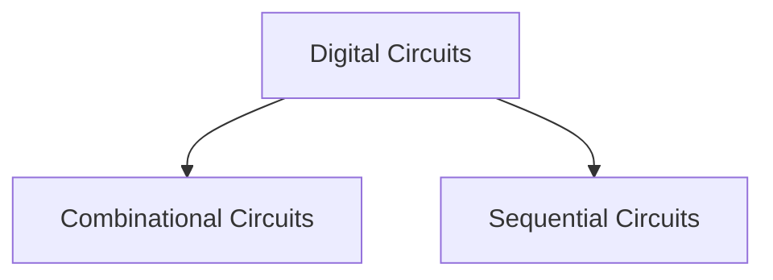

# Boolean Functions vs Digital Circuits

| Boolean Functions | Digital Circuits |
| ----------------- | ---------------- |
|  `0` and `1` signals are not available unless explicitly given                 |   `0` and `1` signals are available by default               |

> [!discussion] 
> ![[Boolean Functions vs Digital Circuits-20240307172117084.webp]]

| Output | State of the Digital Circuit |
| ------ | ---------------------------- |
| 1      | The circuit is set (S)       |
| 0      | The circuit is reset (R)     |

