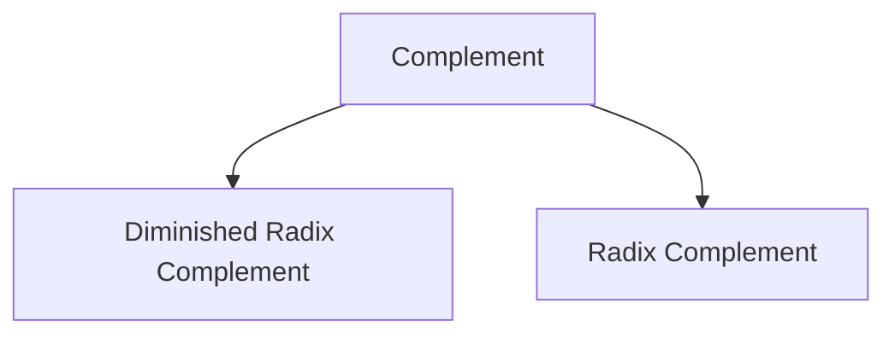

# Complements in Number System

- If $n$ is the number of digits in the number $N$ in base $r$, then
	- Diminished Radix Complement $= (r^n - 1) - N$
	- Radix Complement $= r^n - N$
$$
((r^n - 1) - N) + 1 = r^n - N
$$
$$
\text{Diminished Radix Complement} + 1 = \text{Radix Complement}
$$

> [!trick] To find the $N$'s complement quickly
> 1. Go from right to left (LSP to MSP). 
> 2. Subtract the first non-zero number $x$ from $N$ i.e. $(N - x)$
> 3. and subtract the rest of the numbers $y_i$ from $(N - 1)$ i.e. $(N - 1) - y_i$ 

> [!discussion] 
> ![[Complements in Number System-20240225093342933.webp]]

---

> [!header] Subtraction of Unsigned numbers using $r$'s complement

- If $M$ and $N$ are unsigned numbers

> [!cases] $M \ge N$

- Discard the end carry of the result.

> [!cases] $M \lt N$

- There is no end carry in the result.

> [!summary] 

---

> [!header] Subtraction of Unsigned numbers using $(r - 1)$'s complement

> [!cases] $M \ge N$

- Discard the end carry and add $1$ to the result

> [!cases] $M \lt N$

- There is no end carry in the result

> [!summary] 

---

- The complement of the complement restores the number to its original value.