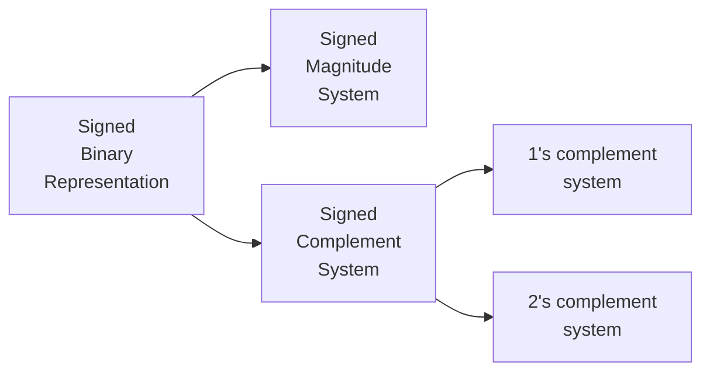

# Representations of Signed Binary Numbers

- There are three number systems for **signed binary** numbers.

- A computer can use any of the above three representations.
- These representations are **only** for binary numbers.

## Signed Magnitude Representation

- If the Most significant bit is,
	- `1` then the number is negative and 
	- `0` then the number is positive 
- The Most Significant Bit is only a sign bit and rest of the bits are magnitude.
![[Signed Binary Numbers-20240225231026664.webp]]
- This representation is not very convenient on computers.
- The magnitude is a unsigned number.
- Signed Magnitude system is **NOT** a weighted system.

| $N$ | $+N$   | $-N$   |
| --- | ------ | ------ |
| $0$ | $0000$ | $1000$ |
| $1$ | $0001$ | $1001$ |
| $5$ | $0101$ | $1101$ |

## 1's Complement Representation

- 1's complement system is a representation and not an operation.
- 1's complement system is **NOT** a weighted system.

> [!cases] $N \ge 0$
- If the number is non-negative, then the 1's complement system is similar to the signed magnitude system.

> [!cases] $N \lt 0$
- The MSB is `1`
- If the number is negative, then $N$ is stored as 1's complement of $+N$
- If the MSB is `1` in a number $M$, then perform 1's complement on the number and if the resultant number is $N$, then $-N$ has been represented in this system as $M$.

## 2's Complement Representation

- 2's complement number system is a weighted number system i.e. with every position, some weight is associated.
- The Most significant position has a negative weight associated with it.

> [!cases] $N \ge 0$
- If the number is non-negative, then the 2's complement system is similar to the signed magnitude system.

> [!cases] $N \lt 0$
- The MSB is `1`
- If the number is negative, then $N$ is stored as 2's complement of $+N$
- If the MSB is `1` in a number $M$, then perform 2's complement on the number and if the resultant number is $N$, then $-N$ has been represented in this system as $M$.

> [!summary] 

- **Positive and unsigned numbers** are represented in the same way in all the three representations that is used in the computer system.

- So in 2's complement system, every number has a unique representation.

> [!important] 
> By default, 2's complement is considered in computers for signed numbers.

---
# Range of Signed Binary Numbers

---
