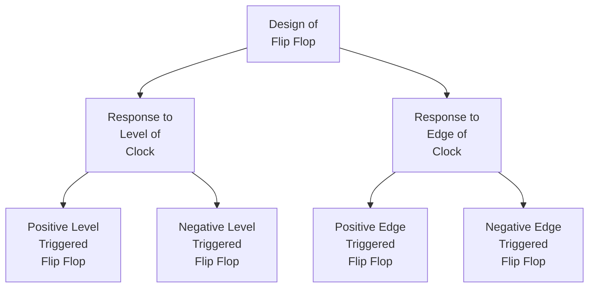

# Flip Flop

- Clock Triggering is a property of flip flop and not clock.
- For any flip flop, by default edge triggering is used.
- [[Clock in Digital Circuits|Clock]] is fixed for all flip flops.
- Don't consider clock in the equations, because any flip flop can have any triggering.
- There are many ways to implement edge triggered flip flop and [[Master Slave Flip Flops]] is one of them.

> [!remember] 
> A clock is not level or edge triggered, but a flip flop is level or edge triggered.

- Flip flops are mostly used as storage devices, hence [[Registers]]. Flip flops can also be used to implement frequency dividers, etc.., hence Counters.