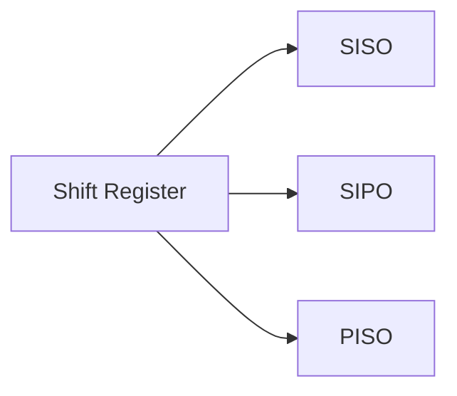

# Registers
> [!youtube] Registers
> [Digital Logic - Registers in Sequential Circuits | Shift Register | Linear Feedback Shift Register | Universal Shift Register | PIOP, SISO, SIPO, PISO - YouTube](https://www.youtube.com/playlist?list=PLIPZ2_p3RNHj7EiWLYGUe0ULdZ6MRSLix)

- A register is a group of flip flops sharing a common clock, each of which is used to store a bit of data.
- A n-bit register consists of n flip flops.
- Registers are commonly used to store and shift (move) binary data.
- Clear input is used to clear or reset the data in the register. Clear input is usually active low.
- Preset input is used to preset or set the data in the register. Preset input is usually active low.

## Load Input

- To control when to store the data, we use load signal or load input in the register 
	- If the load = 0, the stored data should not be changed or data must be retained i.e. $Q_n= Q$
	- If the load = 1, the data should be stored i.e. $Q_n = \text{In}$

- All the flip flops in the register share the same load input.

# Types of Registers

> [!NOTE] 
> There won't be any questions to create registers, but a register will be given and asked to analyze.

## Parallel-In Parallel-Out Register

## Shift Register

- On the triggering edge, shifting occurs in every flip flop in the register.

### Parallel-In Series-Out

### Parallel Access Shift Register
- This register has parallel-in, parallel-out and serial-in, serial-out.

# Applications of Registers

