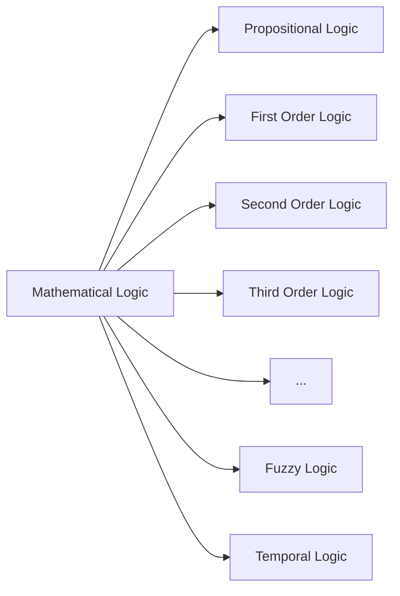

---
version:
  - DM-24
  - DM-23
instructor: DeepakPoonia
tags:
  - DiscreteMath
  - GATE/Dashboard
---
# Discrete Mathematics
- Study of discrete objects
- Example : integers, humans, eggs, etc...

## Discrete Math vs Continuous Math

![[Pasted image 20230907225144.png]]

---
## Mathematical Logic
- Logic for mathematicians and computers
- Natural Languages have ambiguity, but computers cannot have ambiguity
- Logic is the basis for mathematical reasoning and automated systems

### Applications of Mathematical Logic
1. Mathematical logic is to avoid ambiguity in statements and expressions in computers.
2. To find new information from the existing knowledge.

### Types of Mathematical Logic

#### Propositional Logic or 0th Order Logic
- [[Propositional Logic]]
- [[Propositional Variables vs Propositional Formulae]]
- [[Logical Connectives]]
- [[Unless]]
- [[Converse, Inverse and Contra-positive]]
- [[Classes of Propositional Expressions]]
	- [[Tautology in PL]]
	- [[Contradiction]]
	- [[Contingency]]
- [[Logical Equivalence]]
	- [[Important Logical Equivalences]]
	- [[Analysis of Equivalence of Propositions]]
- [[Satisfiable and Falsifiable]]
- [[English - Propositional Logic Translation]]
- [[Write expressions from Tables]]
- [[Arguments and Inference]]
	- [[Rules of Inference]]

#### First Order Logic
- [[First Order Logic]]
- [[Limitations of Propositional Logic]]
- [[Features of First Order Logic]]
- [[Quantifiers]]
	- [[Bounded and Free Variables]]
- [[English-FOL Translation]]
	- [[Numerical-FOL Translation]]
	- [[Nested Quantifiers]]
	- [[Negation of Quantifiers]]
- [[Validity of FOL expressions]]
	- [[Equivalence of FOL expressions]]
- [[Null Quantification]]
- [[Arguments in FOL]]

- [[Doubts - FOL]]

---
## Set Theory

- [[Mathematical Structures]]
- [[Set Definition]]
- [[Set Operations]]
- [[Proofs involving Sets]]
- [[Set Identities]]
- [[Relations]]
- [[Partition of a Set]]
- [[Types of Relations on a Set]]
	- [[Reflexive Relation]]
	- [[Symmetric Relation]]
	- [[Transitive Relation]]
	- [[Equivalence Relation]]
- [[Set Ordering]]
	- [[Hasse Diagram of POR]]
	- [[Hasse Diagram of TOR]]
- [[Lattice]]
	- [[Types of Lattices]]
- [[Analysis on Some Relations]]

- [[Practice Sets]]

- Oscar Levin - [solutions](https://discrete.openmathbooks.org/dmoi3/sec_intro-sets.html) - Practice set 1

---
## Functions
- [[Function Definition]]
- [[Types of Functions]]
- [[Set Operations on Functions]]
- [[Inverse of Functions]]

---
## Group Theory
- [[Abstract Algebra]]
- [[Properties in Group Theory]]
- [[Monoid]]
- [[Group]]
- [[Semi-Group]]

- [[Practice Set]]

> [!youtube] [Group Theory Complete Course - Abstract Algebra Course | Discrete Mathematics | Monoid, Groupoid, Semigroup, Abelian Group, Cyclic Group, Subgroup - YouTube](https://www.youtube.com/playlist?list=PLIPZ2_p3RNHhXves0XVa8d5O6F4rUi3KR)

---
## Combinatronics
- [[Combinatronics]]

> [!youtube] [Recurrence Relations in Discrete Mathematics | Complete Playlist | Applications of Recurrence Relations | GO Classes | GATE Overflow - YouTube](https://www.youtube.com/playlist?list=PLIPZ2_p3RNHhhTH0o1JBMgscMUvxs4E_4)

---

# References
- [Discrete Mathematics - Oscar Levin](https://discrete.openmathbooks.org/dmoi3/dmoi.html)
