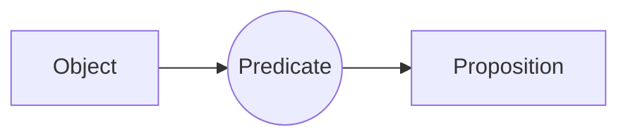
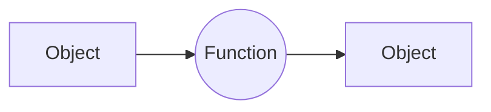

## Objects
- Objects or constants are the elements in a domain.
- object $\equiv$ constant $\equiv$ element
```ad-example
People, Houses, numbers, colors, baseball games, wars, $\ldots$
```

## Domain
- In first-order logic, each variable refers to some object in a set called the domain of discourse or universe of discourse.

> [!attention] 
> - The domain is non-empty, unless explicitly specified otherwise.
> - The domain of every variables in a FOL expression is same, unless specified otherwise.

## Predicates
- A logical expression containing some variable that becomes a proposition when we substitute any particular value from the universe for this variable is called a predicate.
- Relations over or between or among objects is called predicates.
- A predicate is NOT a proposition until a variable is substituted. Once a variable is substituted, it is called Predicate instantiation which becomes a proposition.



1. Predicates over 1 variable are called unary predicate => [[Features of First Order Logic#Property| property]].
2. Predicates over 2 variables are called binary predicate => relationship between two objects.
3. Predicates over n variables are called nary predicates => relationship between n objects.

### When does a predicate become a proposition?
1. Substituting a particular value (object) for the variable from its domain will make the predicate into a proposition.
$$
E(x) = \text{ x is even}
$$
$$
D \in \mathbb{N}
$$
	- E(2) = 2 is even => true
	- E(3) = 3 is even => false

2. Quantification - Bounded by a quantifier.
	- Apply one of the two quantifiers to the predicate to make the predicate a proposition
	- Example
		- P(x) = x is even and D $\in \mathbb{N}$
		1. $\forall x P(x) \equiv$ "For every x, P(x) is true" $\equiv$ "All natural numbers are even"
		2. $\exists x P(x) \equiv$ "There exists an x, for which P(x) is true" $\equiv$ "Some natural numbers are even"
	
```ad-example
- Some birds are angry.
- On the internet, no one knows who you are.
- The square of any real number is non-negative.
```

### Property
- Every object in a domain has one or more properties.
- Unary predicates over one variable are called properties.
```ad-example
red, round, long, bigger than, brother of, part of, comes between, $\ldots$
- All of the properties return a proposition.
```

```ad-example 
##### Predicates as relationship vs property
![[Pasted image 20230916170121.png]]

Predicate 1 => on (x, y) : "x is on y"

on (a, b) : "a is on b" => true.

---
Predicate 2 => red(x) : "x is red"

red(a) : "a is red" => false.

---
- Predicate 1 gives the relationship between two variables x and y, whereas Predicate 2 is a property of the variable x.

```


```ad-note
- A predicate is a function that returns true or false. Hence they are called propositional function.
- predicate $\equiv$ propositional function $\equiv$ relation
```

## Transformations (Functions)
- Functions map objects to another object in the **same** domain.
- Functions should be defined with all the edge and corner cases so as not to transform an object into an object that is not in the domain.



```ad-example
father_of(x), best_friend(x), add(x, y), $\ldots$
- All of the above take in one object and return another object

----
![[Pasted image 20230916170121.png]]

- hat(c) = b
- hat(b) = a
- hat(a) is not defined
```

```ad-info
- Predicates over 0 variables are called 0-ary predicate which is a propositional variable which contains a proposition.
	- Example
		1. p : "a is green" => true
---
- Function with 0 argument is an object from the domain
	- Example 
		1. habitablePlanet() : Earth
```

### Type-checking Table
|             | operate on   | and produce   |
| ----------- | ------------ | ------------- |
| Connectives | propositions | a proposition |
| Predicates  | objects      | a proposition |
| Functions   | objects      | an object              |

## Quantification
- Quantification means "the expression or measurement of the quantity of something" in English dictionary.
- This concept helps in asserting that a certain property holds for all elements or that it holds for some element of a domain.
- In logic, **all** means "for all" and **some** means "at least one" element(s) in the domain.
- Two [[Quantifiers]] are,

$$
\forall \equiv \text{ for all} \equiv \text{ Universal Quantifier}
$$
$$
\exists \equiv \text{ there exists } \equiv \text{ Existential Quantifier}
$$

- Counter examples are used to make a statement false in quantification while witnesses are used to prove a statement true.

```ad-example
D $\in \mathbb{N}$

P(x) = x is even
Q(x) = x is prime
---

$\forall x P(x)$ : Every natural number is even
- The above statement is false
- Counter example : 5
----
$\exists x P(x)$ : Some natural numbers are prime
- The above statement is true
---
$\exists x \neg P(x)$ : Some natural numbers are not even
- Witness : 5
- The above statement is true
```

---

```ad-summary
![[Pasted image 20230916174912.png]]
![[Pasted image 20230916174959.png]]
```

