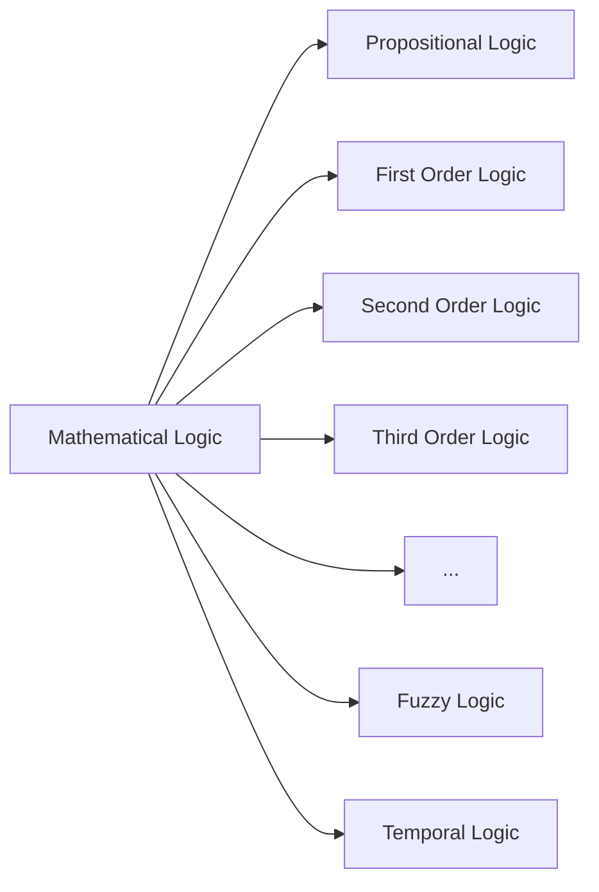

- Logic for mathematicians and computers
- Natural Languages have ambiguity, but computers cannot have ambiguity
- Logic is the basis for mathematical reasoning and automated systems

## Applications of Mathematical Logic
1. Mathematical logic is to avoid ambiguity in statements and expressions in computers.
2. To find new information from the existing knowledge.

### Types of Mathematical Logic

- [[Propositional Logic]] or 0th order logic
- [[First Order Logic]]
