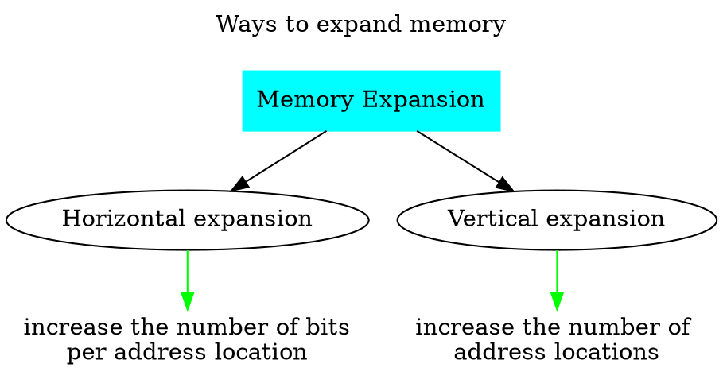
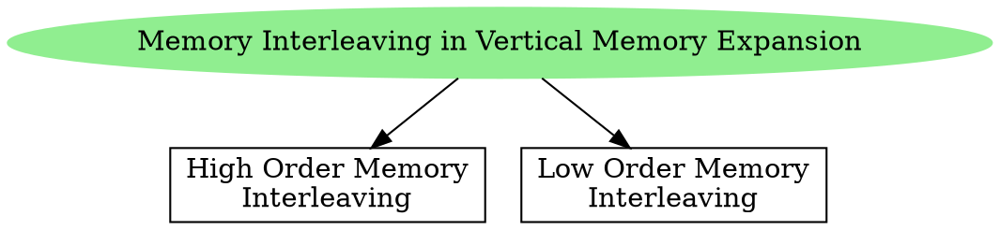

# Memory Organization

- Every memory chip has 3 active-low inputs 
	1. Chip Select (CS)
	2. Read-Enable (RE) or Output-Enable (OE)
	3. Write-Enable (WE)

- These inputs are *control lines* connected to the memory chip. 

![[Memory Interfacing and Expansion-20240721171632368.webp]]
![[Memory Interfacing and Expansion-20240721171356019.webp]]

- Control signals are generated by the control unit of CPU.
- Every memory chip has its own select chip input.
- When chip select is high for a memory chip, the data lines are disconnected from that memory chip.
- The reason for chip select is to avoid the mis-communication of data from multiple chips.

> [!NOTE] 
> Questions such as CS, RE, WE as active-high inputs can be asked in GATE.

![[Memory Interfacing and Expansion-20240721171138822.webp|Basic Organization of a Memory Device]]

---
# Memory Expansion

- Larger memories can be built by expansion.
	1. Horizontal expansion to increase the word size.
	2. Vertical expansion to increase the number of words.

## Horizontal Memory Expansion

Additional data lines are required for horizontal expansion.
All the chips are selected at the same time.
Address lines remain unchanged.

## Vertical Memory Expansion

- **Memory Interleaving** is used to increase the number of address locations.

- Decoders are required to select the chips.

### High Order Memory Interleaving
- In high order memory interleaving, within a memory module (memory chip), the addresses are consecutive.
- A chip is selected and a address is located in that memory chip.

- MS bits of the address bits are chosen to select the chip.

> [!header] Building a $32 \times 32$ chip using $4 \times 32$ chips

![[Pasted image 20240722085711.png]]

![[Memory Interfacing and Expansion-20240721182202392.webp]]

### Low Order Memory Interleaving
- In low order memory interleaving, across the memory modules (memory chip), the addresses are consecutive.

- LS bits of the address bits are chosen to select the chip.

> [!header] Building a $32 \times 32$ chip using $4 \times 32$ chips

![[Pasted image 20240722085730.png]]

![[Memory Interfacing and Expansion-20240721182218050.webp]]

> [!NOTE] 
> There is no name for the interleaving if we choose to pick bits from the middle to select the chips.

> [!summary] 
> In interleaved memory organization, 
> - consecutive words are stored in consecutive memory modules in low order interleaving.
> - consecutive words are stored within the module in high order interleaving.

## Horizontal and Vertical Memory Expansion

![[Memory Interfacing and Expansion-20240721232515158.webp]]

---

