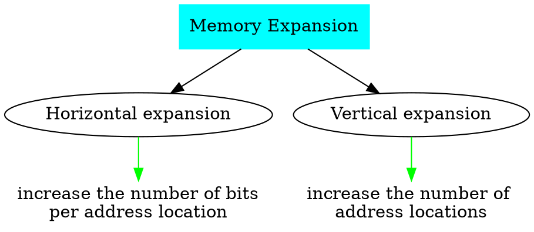
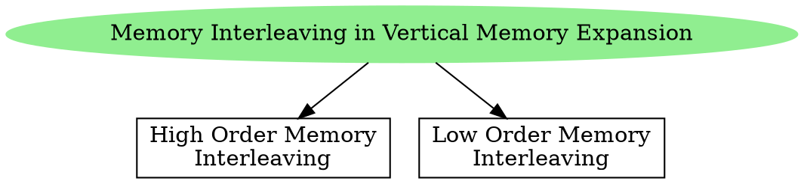

# Memory Organization

Memory Address Register **MAR** is used to store the address generated by the CPU to access (read or write) the memory. Main memory is connected to MAR an **address [[Decoder|decoder]]** that is connected to the address lines.

An address decoder selects exactly one row of the memory array to be active leaving the others inactive. When the microprocessor places a binary number onto the address lines, the address decoder selects a single row in the memory array to be written to or read from.

![[Main Memory and System Bus-20240720143403509.webp]]

Memory Buffer Register **MBR** or Memory Data Register **MDR** is connected to the data lines of the system bus. It contains the data to be stored in memory or the last data read from the memory. 

> [!tip] 
> MAR and MBR are special purpose registers inside CPU.
> 
> The notation $\langle$MAR$\rangle$ means the content of the address pointed by MAR register.

Register transfer instructions for reading from and writing into memory,

1. MBR $\leftarrow$ $\langle$MAR$\rangle$
The content of the address pointed by MAR is stored into MBR registers. The data in the memory is **read** by the CPU.

2. $\langle$MAR$\rangle$ $\leftarrow$ MBR
The data stored in MBR register is stored in the address pointed by MAR register. The data from the register MBR is **written** to the memory.

- Every memory chip has 3 active-low inputs 
	1. Chip Select (CS)
	2. Read-Enable (RE) or Output-Enable (OE)
	3. Write-Enable (WE)
- These three inputs are *control lines* connected to the memory chip. 
- These control signals are generated by the control unit of CPU.
- RE and WE inputs can also be combined onto a single input as $\text{RE} \backslash \overline{\text{WE}}$.

![[Memory Interfacing and Expansion-20240723191748528.webp]]

![[Memory Interfacing and Expansion-20240721171356019.webp]]

![[Memory Interfacing and Expansion-20240723204404221.webp]]

- Every memory chip has its own select chip input. It is like a enable input for memory chip.
- Address lines are used to choose which memory chip is enabled.
- When chip select is high for a memory chip, its data lines are disconnected from the bus.
- Problems occur when one more than one device tries to communicate with the processor over shared links at the same time.

![[Memory Interfacing and Expansion-20240723190958718.webp|Memory chip 1 is selected]]

- The reason for chip select is to avoid the mis-communication of data from multiple chips. 
- At any time, only a single chip has select low.

![[Memory Interfacing and Expansion-20240723190542041.webp|Allowable settings for chip select of 4 memory devices]]

> [!NOTE] 
> Questions such as CS, RE, WE as active-high inputs can be asked in GATE.

![[Memory Interfacing and Expansion-20240721171138822.webp|Basic Organization of a Memory Device]]

---
# Memory Expansion

Larger memories can be built by expansion.
1. Horizontal expansion to increase the word size.
2. Vertical expansion to increase the number of words (addressable units).

> [!pdf] Examples on module-1/lec-03B.pdf Pg. No. 48 (optional)

## Horizontal Memory Expansion

In horizontal memory expansion, the number of bits per word are increased but the number of locations (addresses) are not increased.

The number of address lines remain unchanged.
There is no memory interleaving in horizontal memory expansion.
Additional data lines are required since the capacity of a word has been increased.
All the corresponding horizontal chips are activated at the same time. 

## Vertical Memory Expansion

In vertical memory expansion, the number of locations (addresses) are increased but not the capacity of a word.
**Memory Interleaving** is used to increase the number of address locations.

In vertical memory expansion, [[Decoder|decoders]] are required to select the chips.

If the chip select is active low, then active low decoder is required and if the chip select is active high, then active high decoder is required.

### High Order Memory Interleaving

In high order memory interleaving, the addresses are consecutive within a memory chip, since the MS bits of the address bits are chosen to select the chip.

> [!header] Building a $32 \times 32$ chip using $4 \times 32$ chips

![[Pasted image 20240722085711.png]]

The consecutive addresses are within the memory chip.

![[Memory Interfacing and Expansion-20240721182202392.webp]]

> [!question] What happens if we choose some bits in the middle to select the chips?

As the bit used to select chips moves towards right (towards least signifiant bits), then memory interleaves a lot across the memory chips instead of being consecutive within the chips.

![[Memory Interfacing and Expansion-20240723221033382.webp]]

### Low Order Memory Interleaving

In low order memory interleaving, consecutive addresses are in consecutive memory chips, since LS bits of the address bits are chosen to select the chip.

Low order memory interleaving has its own applications, since each memory chip is activated consecutively because of the need to access consecutive addresses.

> [!header] Building a $32 \times 32$ chip using $4 \times 32$ chips

![[Pasted image 20240722085730.png]]

The consecutive addresses are across memory chips.

![[Memory Interfacing and Expansion-20240721182218050.webp]]

> [!NOTE] 
> There is no name for the interleaving if we choose to pick bits from the middle to select the chips.

> [!summary] 
> In interleaved memory organization, 
> - consecutive words are stored in consecutive memory modules in low order interleaving.
> - consecutive words are stored within the module in high order interleaving.

## Horizontal and Vertical Memory Expansion

![[Memory Interfacing and Expansion-20240721232515158.webp]]

---

