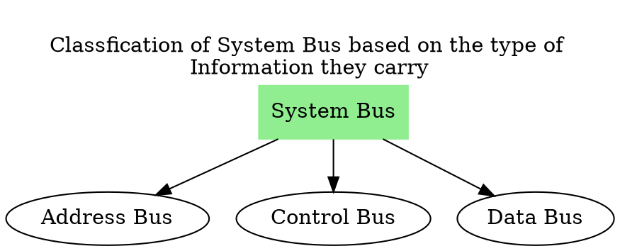

# System Bus




````col
```col-md
flexGrow=1
===
![[System Bus-20240319112721015.webp]]
```
```col-md
flexGrow=0.5
===
**Address Lines:**  
Unidirectional
---
**Data Lines: **
Bi-directional
---
**Control Lines:**
Partially Bi-directional
```
````

