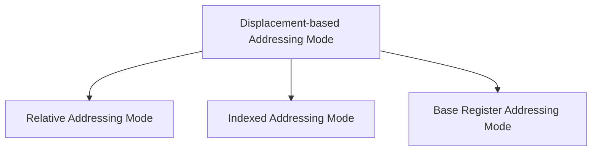

# Addressing Modes

Addressing Modes are all the different ways by which the **location of the operands** is specified in the instruction.

> [!definition] Effective Address
> **Effective address** is the actual address of the operand.
> 
> $\text{EA}$ - address of the operand
> $[\,\text{EA}\,]$- content/data at the address of the operand i.e operand
> 
> ![[Addressing Modes-20240803130215929.webp|300]]

The possible locations of an operand are register, memory and the instruction itself.

## Immediate Addressing Mode

- In immediate addressing mode, IR(address) itself is the operand or the data instead of the address of the operand.

![[Addressing Modes-20240802114701276.webp]]

- Immediate addressing mode is used to define constant or set initial values of variables.
- The instruction contains the value itself which is represented by preceding a $\#$ in the instruction.

- The size of the operand is restricted by the address field. Since the value to be loaded is fixed at compile time, it is not very flexible.
- Immediate addressing mode is very fast because the value to be loaded is available in the instruction i.e. no need to access memory for the data.

## Stack Addressing Mode

- It is also called as implied or implicit addressing mode.
- *Opcode* tells us the location of the operand. The location of the operands are implied in the instruction.

- Instructions such as `CLC` (clear carry) implies that the operand is the carry flag (which has to be cleared or reset).
- In [[Instruction Set Architecture#Stack-Based ISA|Stack-based ISA]], the opcode implies that all the operands are in the stack.

![[Addressing Modes-20240802114913785.webp]]

- In [[Instruction Set Architecture#Accumulator ISA|Accumulator based ISA]], one of the operands is implied as the accumulator.

## Direct Addressing Mode

- It is also called as absolute addressing mode.
- The operand is in the memory and the *address of the memory location* is explicitly given in the instruction.
- Effective address is in IR(address) in this mode.

![[Addressing Modes-20240802114720364.webp]]

- In [[Instruction Set Architecture#Accumulator ISA|Accumulator based ISA]], one of the operands uses direct addressing mode to specify the operand location.

- The value of the operand is not restricted by the size of the address field, as the address field contains only the address.
- Variables(local, static, global) can be represented or accessed using direct addressing mode.
- Direct addressing mode does not provide relocatable code. It gives only position dependent code.

## Register Addressing Mode

- The operand is the content of the processor register. The name (address) of the register is given in the instruction.
- Address field contains the address of a register.

![[Addressing Modes-20240802114759295.webp]]

- The register address field is small in the instruction compared to the direct addressing mode as most modern computers have at most 64 GPRs.
- There is no memory access in this addressing mode.

## Indirect Addressing Mode

- The address field contains a memory address, which in turn contains another memory address in which the operand is available.
$$EA = [\,\text{IR (address)}\,]$$
- It is also called as memory indirect or memory deferred addressing mode.

![[Addressing Modes-20240802114739959.webp]]

- In assembly language, either $(M)$ or $@ \,M$ is used to represent the operand in indirect addressing mode.
- Pointers in programming can be implemented using indirect addressing mode. The register or memory location that contains the address of an operand is called a pointer.

> [!example] 
> ![[Addressing Modes-20240802121017838.webp]]

## Register Indirect Addressing Mode

- The operand is a register and it contains the address of  a memory location.
- It is also called as register deferred addressing mode.

![[Addressing Modes-20240802121150398.webp]]

- In assembly language, either $(R)$ or $@ \,R$ is used to represent the operand in indirect addressing mode.
- It is similar to the indirect addressing mode, but IR(address) contains the address of a register.
- It has to do one memory access, but requires lesser address space than that of Indirect addressing mode.

> [!example] 
> ![[Addressing Modes-20240802125019802.webp]]

> [!example] 
> ![[Addressing Modes-20240802125716096.webp]]
> 
> ![[Addressing Modes-20240802125728801.webp]]

## Displacement Based Addressing Mode

- Combines the capabilities of *direct addressing* and *register indirect* addressing.
- The address field of the instruction is added to the contents of a **specific or special purpose register** in the CPU.
$$
\text{Effective Address}  = \text{address part of instruction} + \text{content of a register}
$$
- Based on *register used*, there are three types of displacement based addressing modes.

![[Addressing Modes-20240802155408355.webp]]

- Instructions have two address fields, at least one of which is explicit A, an operand in the main memory. The other address field R can be implicit reference based on opcode, or can explicitly refer to a register.
$$
EA = A + (R)
$$
- Though this addressing mode is flexible, it adds to the complexity.

> Special Purpose registers are implied implicitly in instructions.

### Indexed Addressing Mode

- Indexed addressing mode is used for implementation of array in assembly language. 

> [!analogy] 
> **Array Implementation in C**
> 
> For array implementation, base address of the array and the index value is required.
> 
> Base address of an array remains fixed or constant.
> 
> Index values is the variable, which is the distance between the base address and the address of the element in the array.

- To get the effective address of an element of an array, the base address of the array is added with the content of the index register. Usually, index registers contain positive displacement from the base address.
$$
EA = A + (R)
$$
- Every element in an array is stored relative to the base address of the register. By incrementing or decrementing the index register value, the effective address of the elements of the array can be obtained.

![[Addressing Modes-20240802163802508.webp]]

- $A(R)$ is the notation for indexed addressing mode in instrutions in assembly language. This is similar to array notation in C.

- Index Register can be either a special purpose register or a general purpose register.
- If the index register is a special purpose register, it is implictly implied in the instruction and if the index register is a GPR, it must be explicitly specified in the instruction.

- If an index-type instruction does not include the address field in its format, then the instruction converts to the register indirect mode of operation.

> [!example] 
>> LDA (load accumulator) in each addressing mode
> 
> ![[Addressing Modes-20240802203129777.webp]]

### Relative Addressing Mode

- [[Registers and Status Flags in CPU#Program Counter PC|Program counter]] is used as the register in this mode. It is also called as PC-Relative addressing mode.
- $A$ acts as an offset to be added with the value in Program counter which is an address. 
$$
EA = PC + A
$$
- The position of the effective address in memory is relative to the address of the next instruction.
- The field $A$ is in 2's complement representation i.e. signed number, can be either negative or positive. The field $A$ requires less number of bits, which results in a shorter address field.

![[Addressing Modes-20240802224323898.webp]]

- In relative addressing mode, offset $A$ is a <mark class="hltr-yellow">displacement from the next instruction</mark>, because when the current instruction has been fetched, program counter updates to the address of the next instruction.
- Relative addressing mode is used to write ***relocatable code*** (position independent code), since $A$ is an offset instead of an address.
- Relative addressing is used with [[Instruction Type#Transfer of Control Instructions|branch-type instructions]] and most CPU use relative addressing mode instead of direct addressing mode.

> [!example] 
> ![[Addressing Modes-20240803132634660.webp]]
> 
> ![[Addressing Modes-20240803132653575.webp]]

For a positive offset, it gives a forward jump and for a negative offset, it gives a backward jump.

> [!example] 
>> [!question] 
>> Convert the given code in [[#Direct Addressing Mode]] to Relative addressing mode.
>> 
>> ![[Addressing Modes-20240803133444021.webp]]
> 
>> Calculating the offset (A),
>
> ![[Addressing Modes-20240803133522135.webp]]
> 
>> This is a relocatable code (position independent code)
>
> ![[Addressing Modes-20240803133701863.webp]]

> [!example] 
> ![[Addressing Modes-20241103222947075.webp]]

> [!example] 
> ![[Addressing Modes-20240803172451560.webp]]
> 
> ![[Addressing Modes-20240803172507287.webp]]

### Base Register Addressing Mode

Base register addressing mode is a better way to write relocatable code than relative addressing mode.

The compiler converts the source code to assembly language which consists of labels/offsets/line numbers for each instruction instead of physical address.

![[Addressing Modes-20240803173433526.webp]]

When the program is loaded into the main memory, the starting address of the program is stored in the **Base Register BR**.

![[Addressing Modes-20240803174145864.webp]]

Relocatability has been acheived and to get the effective address,
$$
\text{EA} = (\, \text{Base Register} \, ) + A
$$

In each instruction, $A$ is an offset with respect to the base register. $A$ is an unsigned number.

![[Addressing Modes-20240803174324490.webp]]

![[Addressing Modes-20240803174332933.webp]]

For jump instructions, relative addressing mode is more relevant and for relocatable code, base register addressing mode is more relevant.

If the base register is special purpose register, then it is implied implicitly in the instruction and if the base register is a general purpose register, then it is explicitly specified in the instruction.

> [!example] 
> ![[Addressing Modes-20240803175355137.webp]]
> 
> ![[Addressing Modes-20240803175346413.webp]]

> [!summary] 

![[Addressing Modes-20240802115135310.webp]]

## AutoIncrement and AutoDecrement Addressing Modes

This addressing mode is same as [[#Register Indirect Addressing Mode|register indirect addressing mode]] as the register contains the effective address of the operand, but after the computation of effective address, the value of the register is incremented or decremented by the operand size.
Operand size can be either a byte (8 bits), or a word, or a double (2 $\ast$ word).

AutoIncrement addressing mode is represented as $(R)\,+$ in the instructions.
$$
\text{EA} = (R)\,+
$$

AutoDecrement addressing mode is represented as $-\,(R)$ in the instructions.
$$
\text{EA} = -\,(R)
$$

This addressing mode is useful in,
1. loop implementations (increment/decrement)
2. when the operands (data) are at successive locations.

# Specifying Addressing Mode

Since Control Unit decodes the instruction and sends signals, there are two ways to specify addressing modes in an instruction since instructions are binary sequences. 

1. Addressing mode is implicit which is indicated via opcode.
2. An additional field called mode in the instruction specified the addressing mode explicitly.

![[Addressing Modes-20240803191019914.webp]]

---