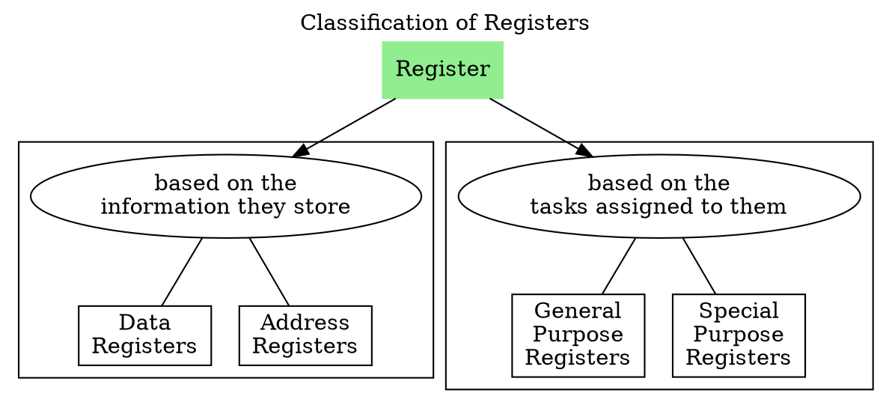

# CPU

![[Registers and Status Flags-20240723143716653.webp]]

The CPU contains,
- a lot of registers, some of which fall on the address side and some of which fall on the data side,
- an arithmetic and logic unit ALU and control unit CU,
- connections to [[Main Memory and Addressability|memory]] through uni-directional address lines and bi-directional data lines,
- an internal bus within the processor which connects different components such as ALU, CU, GPRs, IR, MAR, MBR and other registers.

![[Registers and Status Flags in CPU-20240801224222620.webp]]

The registers, ALU and the interconnecting bus are collectively referred to as the **datapath**.

Control Unit decodes the opcode of the instruction and generates the control signals.

Arithmetic unit performs operations such as addition, subtraction, increment, decrement, negation.
Logic unit performs operations such as AND, OR, NOT, XOR, numberical checks.

# Registers in CPU

A [[Registers|register]] is a storage device inside the CPU. Registers are the memory elements inside CPU.
![[Registers and Status Flags in CPU-20240730231325692.webp]]
![[Registers and Status Flags in CPU-20240730231343112.webp]]

Data registers store data or instruction, whereas address registers store addresses.

GPRs can be used for any purpose, but whereas SPR has predetermined functionality.

## Special Purpose Registers

To store address,
1. Memory Address Register (MAR) 
2. I/O Address Register (I/O AR) 
3. Program Counter (PC) 
4. Stack Control Register

To store data or instructions,
1. Memory Buffer Register (MBR) 
2. I/O Buffer Register (I/O BR)
3. Instruction Register (IR)
4. Accumulator Register (AC)
5. Flag Register/Program Status Word

### Memory Address Register MAR

Memory Address Register MAR is used to store the *address* generated by the CPU to acccess main memory. It is connected to the address bus of the system bus through address decoder.

![[Registers and Status Flags in CPU-20240730233917668.webp]]

### Memory Buffer Register MBR

Memory Buffer Register MBR or Memory Data Register MDR stores the information that is being sent to, or received from the memory along the bi-directional data bus. MBR stores *data or instruction*.

![[Registers and Status Flags in CPU-20240730233928072.webp]]

### Program Counter PC

- Program Counter PC is a register and also a [[Counters|counter]] in the CPU connected to the internal address bus of the CPU, that stores the address of the next instruction to be fetched for [[Instruction Execution Cycle|execution]].
- PC is also called as Instruction Address Register or Instruction Pointer Register.
- PC is connected to the main memory via MAR.
- PC does not depend on ALU's to increment to the next address. 

### Instruction Register IR

Once data is read from memory, it first goes to MBR and if the data is an instruction, then it moves to Instruction Register. 

IR holds the *current instruction* that we are executing or about to execute.

### Stack Pointer SP

Stack Pointer SP is connected to the internal address bus and holds the *address of the top of the stack* of the process in main memory during program execution.

![[Registers and Status Flags in CPU-20240730234721052.webp]]

### Accumulator AC

Accumulator AC register is associated to ALU. AC is connected to memory via MBR. 
AC stores the data that is being worked on by ALU i.e. the result of computation of ALU, and sometimes one of the operands of the ALU.

### Flag Register

Flag register is also associated to ALU. Status register sets flags to the result computed by ALU for the control unit. 

ALU does not anything about the data *(signed, unsigned, positive, negative, binary or BCD)* it is operating, it simply performs the operations as per the instruction and updates the [[#Status Flags|flags]]. It is upto the control unit CU to interpret the results of ALU with the help of flag register.

Flag register is also called as,
1. Status Register SR
2. Program Status Register PSR
3. Program Status Word PSW
4. Status Word SW

Six Status flags monitor the result of ALU.

---
# Status Flags 

Status flags reflect the result of an instruction executed by the processor. Status register stores *status bits* which are also called as condition-code or flag bits.

## Zero Flag

Zero flag is set to 1 whenever the output of the ALU is 0 or else reset to 0. It is represented as ZF or Z.

## Sign Flag

Sign flag is set to 1 if the MS bit of the result is 1 or else cleared to 0. It is used to identify if a number is negative in signed interpretation. It is represented as SF or N. It is also called as Negative Flag.

## Carry Flag

Carry flag is set to 1 when the end carry is 1 or reset to 0 if there is no end carry from the most significant bits. It is represented as C or CF.

## Auxiliary Carry Flag

Auxiliary carry flag is set to 1 if there is a carry from the first nibble (least significant 4 bits) in the least significant byte regardless of the operand size or else cleared to 0. It is represented as AF.

> [!example] 
> ![[Registers and Status Flags in CPU-20240731083952259.webp]]
> 
> Auxiliary Carry Flag AF is set.

## Parity Flag

Parity flag is set to 1 if the lowest byte (least significant 8 bits) of the result has even number of 1s or else cleared to 0. It is represented as PF.

> [!example] 
> ![[Registers and Status Flags in CPU-20240731084533846.webp]]
> 
> Parity flag PF is set

## Overflow Flag

Overflow flag is set to 1 if there is an [[Overflow of Signed and Unsigned Numbers|overflow]] i.e. set to 1 if the exclusive-OR of the last two carries is equal to 1 or else cleared to 0. It allows the control unit to detect overflow during [[Overflow of Signed and Unsigned Numbers#2's Complement Representation|2's complement addition]]. It is represented as V or OF.

V is set to 1 if $A_{\text{msb}} = 1, B_{\text{msb}} = 1, O_{\text{msb}} = 0$ or $A_{\text{msb}} = 0, B_{\text{msb}} = 0, O_{\text{msb}} = 1$.

> [!example] 

![[Registers and Status Flags in CPU-20240731085233089.webp]]

![[Registers and Status Flags in CPU-20240731085501490.webp]]

# Instructions affecting Flags

Once a flag is set or reset, it remains the same until another instruction that affects the flags is executed.

Data transfer instructions do not affect any flags. Since they are not aritmetic operations, they are just logistical operations that transfer data.

![[Registers and Status Flags in CPU-20240727110032070.webp]]

> [!example] 
> ![[Registers and Status Flags in CPU-20240731085950573.webp]]

Zero flag is set in the following examples,

![[Registers and Status Flags in CPU-20240731090329671.webp]]

Carry flag is not set in the following examples,

![[Registers and Status Flags in CPU-20240731090304526.webp]]

---