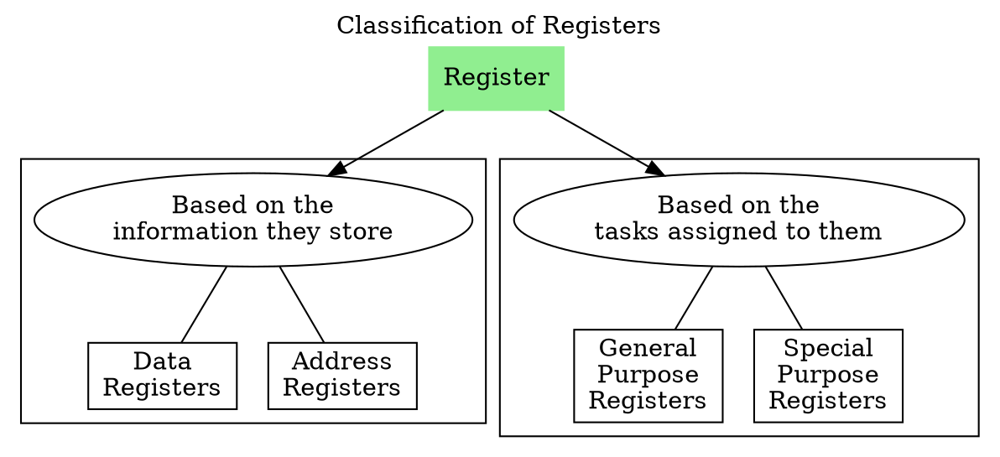

# Registers in CPU

- A [[Registers|register]] is a storage device inside the CPU.

**Program Counter PC**
- Program Counter PC is a register and also a [[Counters|counter]] in the CPU, that stores the address of the next instruction to be fetched for execution.
- PC is connected to the internal address bus.
- PC is also called as Instruction Address Register or Instruction Pointer Register.

**Instruction Register IR**
- Once instruction is fetched from main memory, it is stored in Instruction Register IR.

**Stack Pointer SP**

**Accumulator AC**

**Flag Register**

---
# Status Flags
- Status flags reflect the result of an instruction executed by the processor.
- ALU simply performs the operation and updates the flag based on the result of the operation.

## Zero Flag
- Zero flag is set to 1 whenever the output of the ALU is 0.

## Negative Flag (Sign Flag)
- Sign flag is set to 1 if the MS bit of the result is 1.

## Carry Flag
- Carry flag is set to 1 when there is a carry from the adder.

## Auxiliary Carry Flag
- Auxiliary carry flag is set to 1 if there is a carry from the first nibble.

## Parity Flag
- Parity flag is set to 1 if the lowest byte has even number of 1s.

## Overflow Flag
- Overflow flag is set to 1 if there is an [[Overflow of Signed and Unsigned Numbers|overflow]].
