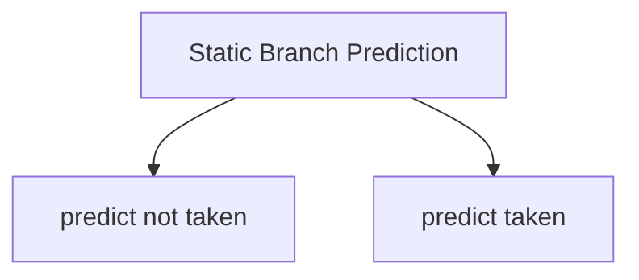

# Control Hazards in Pipeline

Instructions have control dependencies when there is a [[Instruction Type#Transfer of Control Instructions|branch instruction]].

When the branch target is known at some stage, it is called branch resolution.

> Which stage resolves the branch target will be given in the question.

When branch is resolved at $k^{th}$ stage, then $(k-1)$ unwanted instructions has already arrived and have to be flushed i.e. $(k-1)$ stalls. 
These stalls are called as **branch penalty** as these are additional cycles wasting time.

## Handling Control Hazards

### Stall

Stop fetching after every branch instruction until branch resolution is done. 
IF stage has additional logic or hardware to find out if the instruction is a branch instruction or not.

### Static Branch Prediction

Keep fetching the next instruction. 
If the instruction is know to be a branch instruction, we just assume either it is taken or not taken.

IF stage contains additional logic to find if the instruction is a jump instruction or not.

If the prediction fails, then flush the fetched instruction (create $k-1$ stalls).

Condition checking will be done by the ALU, since it has all the arithmetic and logical operations.

<u>predict taken</u> : for every branch instruction, we assume that the branch is taken

<u>predict not taken</u> : for every branch instruction, we assume that the branch is not taken. It is easier to implement. It is the default solution for control hazards.

When a RISC machine encounters a branch instruction, there are only two possible outcomes, either the branch is taken, or the branch is not taken. So, if you do not want to wait until the branch instruction completes, you must guess which instruction you will execute next. This is prediction.
There are multiple methods of branch prediction, predict-taken, predict-not-taken, and dynamic-hardware-prediction will be covered below. Predict-taken and predict-not-taken are just flip sides of the same coin. They both assume that more often than not, a program will do the same behavior. With predict-not-taken, the hardware assumes that the next instruction to be executed will be the instruction following the branch instruction in memory. This (possible) next instruction is placed in the pipe and execution begins. If after the branch is finished executing, it is found that we really wanted to take the branch, then the (possible) next instruction that we had been executing is thrown out by the hardware, and we being executing the correct instruction, the branch target.

Only the initial stages don't know whether the branching occurs or not, so its alright to go for a static prediction.

> [!example] 
> ![[Control Hazards in Pipeline-20240812234554164.webp]]
> 
> [Arjun Sir answer](https://gateoverflow.in/683/gate-cse-2000-question-12?show=4878#a4878)

Ideally, CPI = 1 (for every cycle, an instruction gets executed, assuming the instruction is not a branch instruction)

![[Control Hazards in Pipeline-20240812234950102.webp]]

![[Control Hazards in Pipeline-20240812235318896.webp]]

Predict not taken is better than stalling after every branch instruction.

---

> [!question] 
> Why static branch prediction is better than stalling?

---

### Dynamic Branch Prediction

The prediction keeps changing based on the new evidence.

### Delayed Branch

Compiler selects a suitable independent instruction in the delay slot.
The independent instruction will be executed regardless of whether the branch instruction is taken or not.

