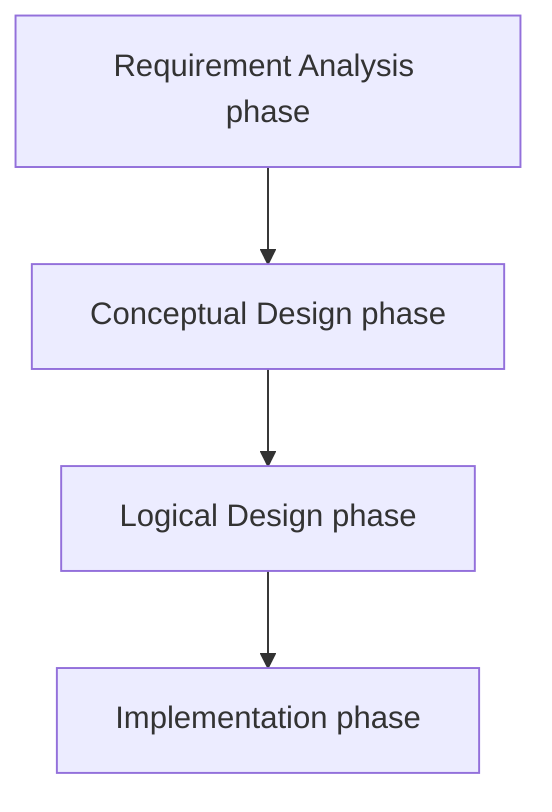

# DBMS

- Data is a known fact that can be stored or recorded.
- Database is a large collection of inter-related data. It can be very large and of varying complexity.
- DMBS is a software package (collection of programs) to help build, manage the database. Without DBMS, database becomes a liability rather than an asset.
- Database models a real-world organization (e.g. enterprise, university).

> [!definition] Database System (DBS)
> DBS = Database + DBMS
> A computerized system to maintain the information and make the information available on demand.

![[Introduction to DBMS-20231212132828103.webp]]

## Advantages of DBMS

To understand the need for a DBMS, let us consider a motivating scenario: 

> A company has a large collection (say, 500 GB) of data on employees, departments, products, sales, and so on. This data is accessed concurrently by several employees. Questions about the data must be answered quickly, changes made to the data by different users must be applied consistently, and access to certain parts of the data (e.g., salaries) must be restricted.

We can try to deal with this data management problem by storing the data in a collection of operating system files. This approach has many drawbacks, including the following,

1. We probably do not have 500 GB of **main memory** to hold all the data. We must therefore store data in a storage device such as a disk or tape and bring relevant parts into main memory for processing as needed.
2. We have to write special programs to **answer each question** that users may want to ask about the data. These programs are likely to be complex because of the large volume of data to be searched.
3. We must protect the data from **inconsistent changes made by different users** accessing the data concurrently. If programs that access the data are written with such concurrent access in mind, this adds greatly to their complexity.
4. We must ensure that **data is restored** to a consistent state if the system crashes while changes are being made.
5. Operating systems provide only a password mechanism for **security**. This is not sufficiently flexible to enforce security policies in which different users have permission to access different subsets of the data.

The below are the advantages of DMBS,

1. **Data independence:** Application programs should be as independent as possible from details of data representation and storage. The DBMS can provide an abstract view of the data to insulate application code from such details.
2. **Efficient data access:** A DBMS utilizes a variety of sophisticated techniques to store and retrieve data efficiently. This feature is especially important if the data is stored on external storage devices.
3. **Data integrity and security:** If data is always accessed through the DBMS, the DBMS can enforce integrity constraints on the data. For example, before inserting salary information for an employee, the DBMS can check that the department budget is not exceeded. Also, the DBMS can enforce access controls that govern what data is visible to different classes of users.
4. **Concurrent access and crash recovery:** A DBMS schedules concurrent accesses to the data in such a manner that users can think of the data as being accessed by only one user at a time. Further, the DBMS protects users from the effects of system failures.

## DBMS Design Process

**1. Requirement Analysis phase**
- Gather information about the data.

**2. Conceptual Design phase**
- Represent the gathered information in an user-friendly model. Example: ER model
- If the database designer is an expert, then conceptual design phase can be skipped. But for a larger and complex data, this phase is necessary.

> [!fact] 
> No DBMS software is based on ER model

**3. Logical Design phase**
- Conceptual design is converted to logical design using implementation friendly model. Example: Relational model (table)

![[Introduction to DBMS-20240704183705786.webp]]

- The models in conceptual design phase and logical design phase has nothing to do with each other. Both are different.

**4. Implementation phase**
- Physical design phase

![[Introduction to DBMS-20240704174817359.webp]]
![[Introduction to DBMS-20240704183744699.webp]]

---
## Data Models

Data models are a set of rules or conventions to represent or store or manage the data.

![[Introduction to DBMS-20240704175408397.webp]]

Data models are a collection of tools for describing data, data relationships, data semantics and data constraints.
A data model is a collection of high-level data description constructs that hide many low-level storage details.
A data model can be converted to another data model.

> [!question] Why model a data?
> To analyze the data

Relational Data Model is a theoretical data model
RDBMS is a software based on relational model and it is the most widely used in the dbms market.

----