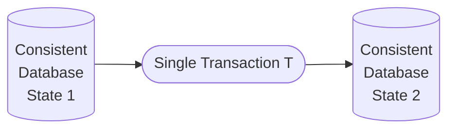

# ACID Properties

These are the desirable Properties for [[Transaction]] Processing
Every property is responsible for preserving the database consistency.

> [!NOTE] 
> - Consistency property is the responsibility of Programmer
> - Atomicitiy, Durability and Isolation properties are the responsibilities of Transaction and Recovery Manager

![[ACID Properties for Transaction Processing-20231212135912528.webp]]
## Atomicity Property
- It is also called as **all-or-none** property.
- Either execute a transaction completely or do not execute it at all.
- No transaction must be left half-done.

## Durability Property
- After the commit of a transaction ${} T$, despite any failure all the changes by transaction $T$ must reflect in the database.
- This property is also called as **Permanency**.

## Consistency Property
- No coding error in within the transaction.
- It is also called as the correctness principle.
- A particular transaction must take a database from consistent to consistent state.
- An individual transaction must be correct. It is the responsibility of the programmer and NOT the DBMS software.
- A transaction must preserve the database consistency.

^digcons

- *Every transaction is consistent* means transaction maintains or preserves database consistency.

> [!question] 
> Can DBMS enforce consistency property?

> [!summary] 
> Assume that a particular transaction is always consistent.

## Isolation Property

> [!abstract] 
> - a pseudo feel that you are executing alone

- A transaction should not see the changes made by another transaction.
- To ensure isolation property, do not read changes done by uncommitted transactions.
- Concurrency control component is responsible for ensuring isolation.
- There are many ways to ensure isolation property. One of the strongest ways to ensure is Serializability.
- Serial Execution ensures isolation property but the performance is really poor i.e. poor throughput.
- [[Serializability]] allows those concurrent executions whose effect is similar to some serial schedule.