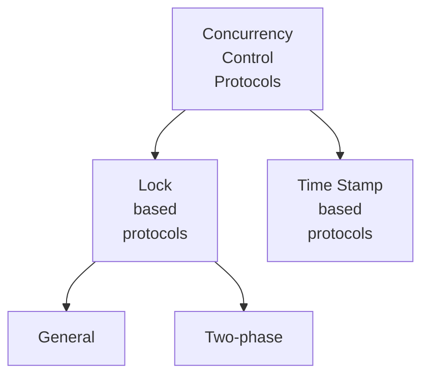

# Concurrency Control
- Concurrency control ensures isolation property while concurrent execution of transactions.
- Though checking conflict serializability is less complex, but at the end when it is known that is not conflict serializable, it is waste of resources.
- A better idea is to ensure serializability during execution.

> [!question] 
> Why do we need concurrency control protocols?

![[Concurrency Control Protocols-20231215124908309.webp]]

- Concurrency control protocols ensure that the system only allows or generates conflict serializable schedules.
- Since each transaction individually follows these rules, the system automatically allows only conflict serializable schedules.

> [!attention] 
> Each individual transaction will follow concurrency control protocol rules, and NOT for the entire schedule.

- All the protocols care about generating Conflict serializable schedules only, since View serializability is NP complete problem.