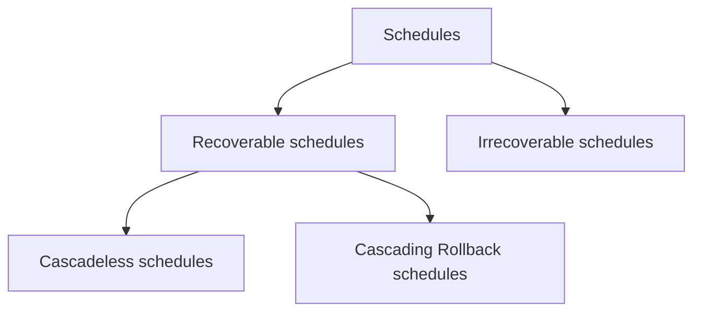

# Recoverability

>[!diagram] Classification of schedules based on Recoverability

> [!NOTE] 
> [[Serializability]] and Recoverability are orthogonal concepts i.e. they have nothing to do with each other.

## Irrecoverable and Recoverable schedules

## Preserve Atomicity

- To ensure atomicity, when a transaction is aborted or system failure occurs, all the transactions that are dependent on the transaction must be aborted as well.

## Types of Recoverable Schedules

## Strict Schedule