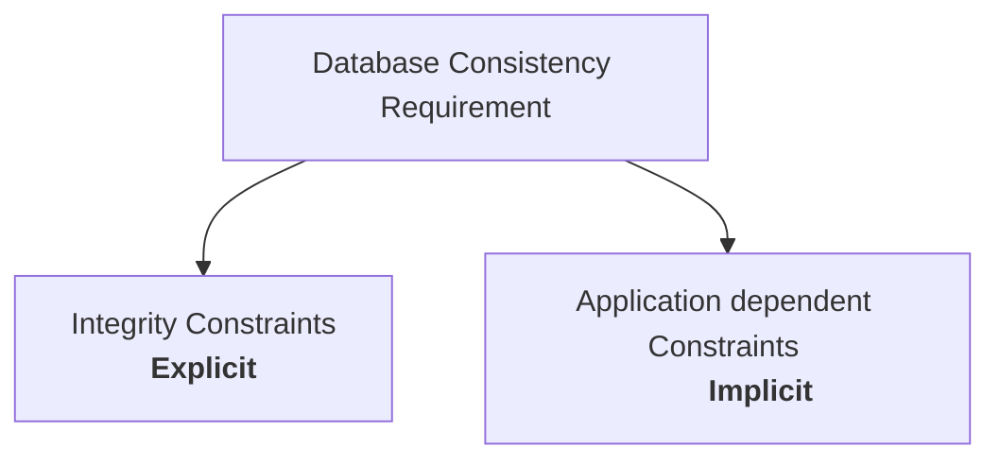

# Transaction
> [!lecture] Lecture-1

- A transaction is a sequence of read-write operations on database items.
- From user point-of-view, a transaction is a single logical task.

> [!doubt] 
> - Every transaction has its own main memory buffer.

- Transaction is the unit of execution of database operations.
- `commit` or `abort` is the end of a transaction. (by default `commit`)
- After `commit`, all the changes may or may not be stored to the disk.
- There are certain [[ACID Properties for Transaction Processing]].
- Transaction time stamp is the time at which the transaction was created.

> [!claim] Assumption
> - There is only once CPU.
> - It can execute only one operation/action at a time.

- A transaction consists of certain arithmetic, logical, read, write operations

## Element of Database

**Element** - Element of a database has a value which can be accessed or modified by transactions.


## State of Database

A database has a state which is a value for each of its element.

```nomnoml
[State of Database] - [Consistent
State]
[State of Database] - [Inconsistent
State]
```

A consistent database is one in which all the constraints are satisfied, whereas in inconsistent state some violation of the constraints has occured.
The consistency requirement is on the database and NOT on transaction.

> Consistency requirement is given by the designer or the developer.



Explicit constraints are [[Standard Integrity Constraints in Relational Model|integrity constraints]] which are the responsibility of DBMS software.

## Database Operation

> [!NOTE] Primitive Operations
> Read operation - only Load operation
> Write operation - only Store operation
 
`write(X, t)` brings the block containing `X` but it doesn't read the `X`, since reading the block containing `X` does not mean reading `X`.

> [!convention] 

## Serial Execution
- Database is consistent after a serial execution
- In serial execution, a transaction begins after the completion of a complete transaction.
- Different serial execution can give different database state.

> [!question] 
> Does Serial Execution always preserve database consistency?

- Serial execution always preserves database consistency.
![[ACID Properties for Transaction Processing#^digcons]]
- It is because of the assumption of the [[ACID Properties for Transaction Processing#Consistency Property|consistency]] property of transactions.
- Every transaction is executing in isolation. One after another.


> [!definition] Throughput
> The number of transactions executed for a unit of time


## Concurrent Execution

- Concurrent means interleaved execution

![[Transaction-20231212220034956.webp|350]]

> [!definition] Concurrency Control
> Database must go from one consistent state to another consistent state after concurrent execution of transactions.

- Buffer in main memory is shared by transactions but each transactions have their own private temporary variables.

## Schedule
> [!lecture] Lecture-5

- A valid schedule must follow the order of operations within a transaction.
- Serial schedule always preserve consistency.
- Concurrent schedules may or may not preserve consistency.
- Every serial schedule is also a concurrent schedule.

![[Transaction-20231213112342617.webp]]

![[Transaction-20231214105933142.webp]]

- We can never swap two non-consecutive operations in any schedule.

## Failure


---
