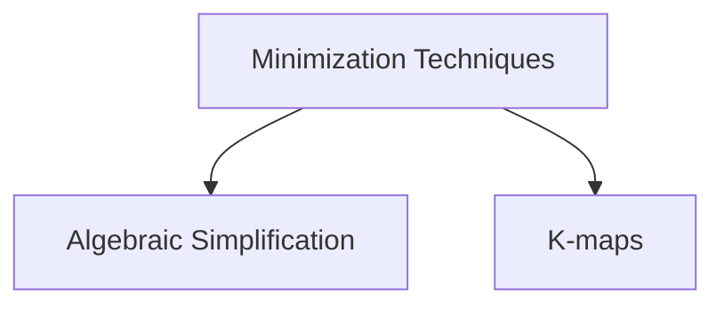

# Boolean Function
A boolean algebraic function can be expressed algebraically with binary variables, the logic operation symbols, paranthesis and equal sign.

> [!question] Why boolean expression is same as a boolean function?
> 
> In boolean functions and boolean expression, the domain and the co-domain are the same
> **Domain** : Input combinations of variables in boolean expression or function
> **Co-domain** : $\{0, 1\}$
> 
> ![[Boolean Function-20240514174816504.webp]]
> ![[Boolean Function-20240514174831630.webp]]

> [!important] 
> `0` and `1` are constant boolean functions and **not** literals.

For a boolean equation $f_1 = f_2$, then
$$
\begin{split}
\text{dual can be applied on both the sides}, \\
f_1^d = f_2^d \\ \\
\text{complement can be applied on both the sides}, \\
\overline{f_1} = \overline{f_2}
\end{split}
$$

![[Boolean Function-20240514173948737.webp]]

It is never possible for a boolean function to be equal to its complement i.e. $f \not= \overline{f}$ 
For a function $f$, the complement $\overline{f}$ and the dual $f^d$ are functions themselves.

> [!header] Number of Different Boolean Functions for $n$ variables

---
## Complement and Dual of Boolean Functions
> [!youtube] 
> [Complement, Dual of a Boolean Function | Self Dual | Positive, Negative Logic System | Digital Logic - YouTube](https://www.youtube.com/watch?v=qed3vHqJicM)

![[Boolean Algebraic Function-20240223114721053.webp|Conversion between a function and its complement]]

![[Boolean Algebraic Function-20240218224735432.webp|Conversion between a function and its dual]]

![[Laws of Boolean Algebra-20240218225050396.webp]]

![[Boolean Algebraic Function-20240223113907531.webp]]

- For any boolean function $f(a, b)$, where $a$ and $b$ are the inputs to the function,
$$f^d(a, b) = \overline{f}(\overline{a}, \overline{b})$$
$$\overline{f}(a, b) = f^d(\overline{a}, \overline{b})$$

---
## Special Types of Boolean Functions

### Neutral Boolean Function
 - A boolean function over $n$ variables is neutral iff $f = 0$ for half of the input combinations and $f = 1$ for the remaining half of the input combinations.

### Self Dual Boolean Function
- $f$ is a self dual function iff $f = f^d$.

- Every self dual function is neutral, but the converse is **NOT** true.

> [!header] Number of Self dual functions for $n$ variables

- In a self dual function $f$, 
$$
f(x) \not= f(\;(2^n - 1)\; - x); \: \forall x \text{ where } 0 \le x \le 2^n - 1 
$$

### Functions whose complement is same as dual

- These functions are palindrome functions.

- In this type of function $f$, 
$$
f(x) = f(\;(2^n - 1)\; - x); \: \forall x \text{ where } 0 \le x \le 2^n - 1 
$$

### EXOR and EXNOR functions
> [!youtube] 
> [ExOr, ExNor functions | Odd function, Even function | Boolean Algebra | Digital Logic | GO Classes - YouTube](https://www.youtube.com/watch?v=-30dUjh6Qv4)

> [!discussion] 
>> In standard definitions, only 2 (even) inputs are used, so XOR and XNOR are complements of each other.
> 
> ![[Boolean Function-20240223184600922.webp]]

---
## Minimization of Boolean Functions

---

