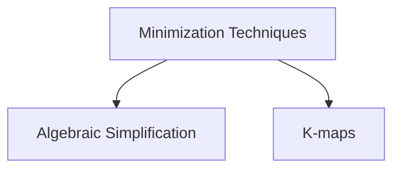

# Boolean Function
A boolean algebraic function can be expressed algebraically with binary variables, the logic operation symbols, paranthesis and equal sign.

> [!question] Why boolean expression is same as a boolean function?
> 
> In boolean functions and boolean expression, the domain and the co-domain are the same
> **Domain** : Input combinations of variables in boolean expression or function
> **Co-domain** : $\{0, 1\}$
> 
> ![[Boolean Function-20240514174816504.webp]]
> ![[Boolean Function-20240514174831630.webp]]

![[Boolean Function-20240514173948737.webp]]

For a boolean equation $f_1 = f_2$, then
$$
\begin{split}
\text{dual can be applied} &  \text{ on both the sides}, \\
f_1^d &= f_2^d \\ \\
\text{complement can be applied}& \text{ on both the sides}, \\
\overline{f_1} &= \overline{f_2}
\end{split}
$$

## Different number of  Boolean Functions over $n$ variables

> [!header] Function over 0 variable 

If there are no boolean variables in a boolean function $f_{1}$, then the $f_{1}$ can be either $f_{1} = 0$ or $f_{1} = 1$ i.e. constant boolean functions.

> [!header] Function over 1 variable 

If there is only one boolean variable in a boolean function $f_{2}$, then the function $f_{2}$ can be any of the below,
$$
\begin{split}
f_{2}\; (a) &= a \\
f_{2}\; (a) &= \overline{a} \\
f_{2}\; (a) &= 0 \\
f_{2}\; (a) &= 1 \\
\end{split}
$$
There are $2^{(2^1)} = 2^2$ different boolean functions over $1$ variable.

> [!header] Function over 2 variables 

If there are $2$ boolean variables in a boolean function $f_{3}$, then there are 16 different boolean functions.

![[Boolean Function-20240518120519372.webp]]
![[Boolean Function-20240619184627058.webp]]

> [!header] Function over $n$ variables 

If there are $n$ boolean variables in a boolean function $f$, then there are $2^{(2^n)}$ different boolean functions.
Each of the $2^n$ different input combinations has only two choices i.e. 0 or 1.

![[Boolean Function-20240518105525322.webp]]
![[Boolean Function-20240518105549538.webp]]

> [!observation] 
> Constant boolean functions `0` and `1` always occur no matter how many variables are there in a boolean function.

---
## Relationship between Complement and Dual of Boolean Functions
> [!youtube] 
> [Complement, Dual of a Boolean Function | Self Dual | Positive, Negative Logic System | Digital Logic - YouTube](https://www.youtube.com/watch?v=qed3vHqJicM)

> [!NOTE] 
> Dual of a boolean function can easily found if the function contains only literals and NOT, AND and OR operations (no other operations).

![[Boolean Function-20240517191636112.webp]]
![[Boolean Function-20240517195617657.webp]]

![[Laws of Boolean Algebra-20240218225050396.webp]]
![[Laws of Boolean Algebra-20240603120312263.webp]]

> [!example] 
> ![[Boolean Function-20240621230915170.webp]]

![[Boolean Function-20240527115918673.webp]]

![[Boolean Function-20240527115933381.webp]]

> [!think] 
> For any boolean function, its dual and complement only varies by the literals.

For any boolean function $f(a, b)$, where $a$ and $b$ are the inputs to the function, then
$$f^d(a, b) = \overline{f}\;(\overline{a}, \overline{b})$$
or it can put it this way,
$$\overline{f}(a, b) = f^d\;(\overline{a}, \overline{b})$$

> [!example] 
> ![[Boolean Function-20240619101843355.webp]]
> 
> ![[Boolean Function-20240517195518874.webp]]
> 
> ![[Boolean Function-20240621231449812.webp]]

For a function $f$, the complement $\overline{f}$ and the dual $f^d$ are functions themselves.

To find the dual of a function $F$ from a truth table (assuming the table is in standard order), reverse the order of the complement of the function $\overline{F}$ to find out the dual of the function $F^d$.

![[Boolean Function-20240527121420948.webp]]

> [!example] 
> ![[Boolean Function-20240527175758734.webp]]

For a function $F$ over $n$ variables, 
$$
f^d\;(t) = \overline{f} \;(\;(2^n - 1) - t)
$$
where $t$ is a decimal value encoded from the input combination and $0 \leq t \leq (2^n - 1)$ 

If $f(t) = 1$, then $\overline{f}\;(t) = 0$ which means $f^d\;(\;(2^n - 1) - t) = 0$.

> [!example] 
> ![[Boolean Function-20240527193041878.webp]]
> ![[Boolean Function-20240527194819374.webp]]

Functions which has the literal count of 1 such as $f(a) = a$, dual is same as the function.
$$
\begin{split}
f(a) &= a  \\ 
f^d(a) & = a \\
\therefore f(a) &= f^d(a)
\end{split}
$$
It is never possible for a boolean function to be equal to its complement i.e. $f \not= \overline{f}$ 

There are some functions $f$ for which $\overline{f} = f^d$.

> [!example] 
> 1. $f = 0$
> 2. $f = 1$
> 3. $f = a \oplus b$

---
## Special Types of Boolean Functions
> [!pdf] lec-07 Pg. no. 151

### Neutral Boolean Function
 - A boolean function over $n$ variables is neutral iff $f = 0$ for half of the input combinations and $f = 1$ for the remaining half of the input combinations.

For a boolean function of $n$ variables, number of neutral boolean functions = ${{2^n}_{C}}_{2^{(n-1)}}$.
Out of $2^n$ rows of input combinations, select the half which gives $1$ as the output, the rest will give $0$ as the output.

![[Boolean Function-20240527204754316.webp]]

### Self Dual Boolean Function

- $f$ is a self dual function iff $f = f^d$.
![[Boolean Function-20240527210411425.webp]]
![[Boolean Function-20240527210423613.webp]]
![[Boolean Function-20240527210440917.webp]]
![[Boolean Function-20240527211143763.webp]]

In a self dual function $f$, 
$$
f(x) \not= f(\;(2^n - 1)\; - x); \: \forall x \text{ where } 0 \leq x \lt 2^n
$$

> [!observation] 
> - Every self dual function is neutral, but the converse is **NOT** true.
> - One half of the outputs are not equal to the other half of the outputs for the $2^n$ input combinations which means half of the outputs are 1s and the other half are 0s.

![[Boolean Function-20240527211221849.webp]]

> [!header] Number of Self dual functions for $n$ variables

![[Boolean Function-20240527211823499.webp]]

Number of self dual functions on $n$-variables $= 2^{(2^{(n-1)})}$, because each row in the first half of the standard truth table has 2 choices, whereas the lower half of the truth table has only one choice i.e. there is no choice for lower half.

![[Boolean Function-20240527211840794.webp]]

### Functions whose Complement is same as Dual
> [!attention] These functions do not have a standard name.

- These functions are palindrome functions.
- These functions are **NOT** neutral boolean functions.

> [!header] Number of such functions over $n$ variables

![[Boolean Function-20240528132747882.webp]]
![[Boolean Function-20240528132801810.webp]]

![[Boolean Function-20240528132844185.webp]]
![[Boolean Function-20240528132853541.webp]]

![[Boolean Function-20240528133016871.webp]]

In this type of function $f$, 
$$
f(x) = f(\;(2^n - 1)\; - x); \: \forall x \text{ where } 0 \leq x \lt 2^n
$$
In this type of function palindrome function $f$, 
$$
f(a_{1}, a_{2}, \cdots , a_{n}) = f(\overline{a_{1}}, \overline{a_{2}}, \cdots , \overline{a_{n}})
$$

Over $n$ variables, there are $2^{(2^{(n-1)})}$ such functions.

### EXOR and EXNOR functions
> [!pdf] Lec-08

> [!youtube] 
> [ExOr, ExNor functions | Odd function, Even function | Boolean Algebra | Digital Logic | GO Classes - YouTube](https://www.youtube.com/watch?v=-30dUjh6Qv4)

![[Boolean Function-20240528135127175.webp]]

**ExOR** operation is commutative and associative and distributive.
![[Boolean Function-20240528135705213.webp]]

**ExNOR** operation is also Equivalence operation or coincidence operation.
![[Boolean Function-20240528135452108.webp]]

**ExNOR** operation is the complement of **ExOR** operation.
![[Boolean Function-20240528135427396.webp]]

**ExNOR** operation is commutative and associative.

![[Boolean Function-20240528135947841.webp]]

A chain of **ExOR** operations can be done in any order since ExOR is commutative and associative.
- ExOR is 1 iff if there are odd number of 1s (number of 0s does not matter)
- ExNOR is 1 iff if there are even number of 0s (number of 1s does not matter)

ExOR is equal to ExNOR when there are **odd** number of inputs
- $a \oplus b \oplus c = 1$ iff there are odd number of 1s
- If there are odd number of 1s in odd number of inputs, then there are even number of 0s, which means $a ⊙ b ⊙ c = 1$
- In this case $a \oplus b \oplus c = a ⊙ b ⊙ c$
$$
a_{1} \oplus a_{2} \oplus \cdots  \oplus a_{2n - 1} = a_{1} ⊙ a_{2} ⊙ \cdots ⊙ a_{2n - 1}
$$
ExOR and ExNOR are complement of each other when there are **even** number of inputs
- $a ⊙ b ⊙ c ⊙ d = 1$ iff there are even number of 0s
- If there are even number of 0s in even number of inputs, then there are even number of 1s, which means $a \oplus b \oplus c \oplus d = 0$
- In this case $a ⊙ b ⊙ c ⊙ d = \overline{a \oplus b \oplus c \oplus d}$
$$
a_{1} \oplus a_{2} \oplus \cdots  \oplus a_{2n} = \overline{a_{1} ⊙ a_{2} ⊙ \cdots ⊙ a_{2n}}
$$

> [!discussion] 
>> In standard definitions, only 2 (even) inputs are used, so XOR and XNOR are complements of each other.
> 
> ![[Boolean Function-20240223184600922.webp]]

---
## Minimization of Boolean Functions

Boolean functions can be minimized to its equivalent boolean expressions, leading to reduced literal count and minimal number of gates.

1. [[Algebraic Simplification of Boolean Functions|Algebraic Simplification]]
2. [[Minimization using K Map|K-maps]]

---
