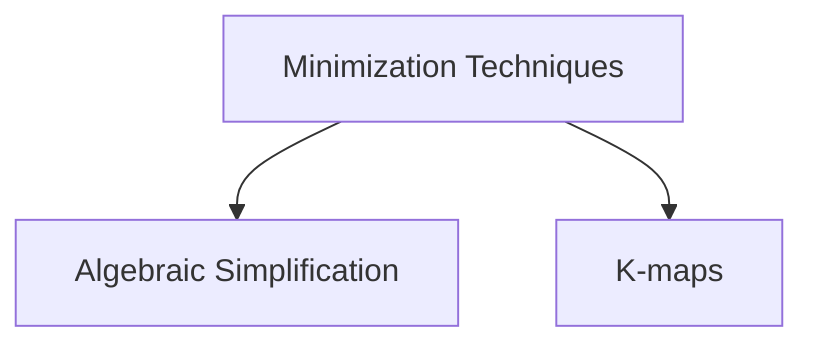

# Boolean Function
A boolean algebraic function can be expressed algebraically with binary variables, the logic operation symbols, paranthesis and equal sign.

> [!question] Why boolean expression is same as a boolean function?
> 
> In boolean functions and boolean expression, the domain and the co-domain are the same
> **Domain** : Input combinations of variables in boolean expression or function
> **Co-domain** : $\{0, 1\}$
> 
> ![[Boolean Function-20240514174816504.webp]]
> ![[Boolean Function-20240514174831630.webp]]

![[Boolean Function-20240514173948737.webp]]

For a boolean equation $f_1 = f_2$, then
$$
\begin{split}
\text{dual can be applied} &  \text{ on both the sides}, \\
f_1^d &= f_2^d \\ \\
\text{complement can be applied}& \text{ on both the sides}, \\
\overline{f_1} &= \overline{f_2}
\end{split}
$$


## Different Boolean Functions for $n$ variables

If there are no boolean variables in a boolean function $f_{1}$, then the function $f_{1}$ can be either $f_{1} = 0$ or $f_{1} = 1$ i.e. constant boolean functions.

If there is only one boolean variable in a boolean function $f_{2}$, then the function $f_{2}$ can be any of the below,
$$
\begin{split}
f_{2}\; (a) &= a \\
f_{2}\; (a) &= \overline{a} \\
f_{2}\; (a) &= 0 \\
f_{2}\; (a) &= 1 \\
\end{split}
$$
There are $2^{(2^1)} = 2^2$ different boolean functions over $1$ variable.

> [!NOTE]
> Constant boolean functions `0` and `1` always occur no matter how many variables are there in a boolean function.

If there are $2$ boolean variables in a boolean function $f_{3}$, then there are 16 different boolean functions.
![[Boolean Function-20240518120519372.webp]]

If there are $k$ boolean variables in a boolean function $f$, then there are $2^{(2^k)}$ different boolean functions.

![[Boolean Function-20240518105525322.webp]]
![[Boolean Function-20240518105549538.webp]]

---
## Complement and Dual of Boolean Functions
> [!youtube] 
> [Complement, Dual of a Boolean Function | Self Dual | Positive, Negative Logic System | Digital Logic - YouTube](https://www.youtube.com/watch?v=qed3vHqJicM)

> [!NOTE] 
> Dual of a boolean function can easily found if the function contains only literals and NOT, AND and OR operations (no other operations).

![[Boolean Function-20240517191636112.webp]]
![[Boolean Function-20240517195617657.webp]]

![[Laws of Boolean Algebra-20240218225050396.webp]]

For any boolean function $f(a, b)$,
$$
{(f^d\;(a, b))}^d = f(a, b)
$$

For any boolean function $f(a, b)$, where $a$ and $b$ are the inputs to the function,
$$f^d(a, b) = \overline{f}\;(\overline{a}, \overline{b})$$
$$\overline{f}(a, b) = f^d\;(\overline{a}, \overline{b})$$

````col
```col-md
flexGrow=1
===
![[Boolean Function-20240527115918673.webp]]
```
```col-md
flexGrow=1
===
![[Boolean Function-20240527115933381.webp]]
```
````

> [!example] 
> ![[Boolean Function-20240527115740515.webp]]
> ![[Boolean Function-20240517195518874.webp]]

Functions which has the literal count of 1 such as $f(a) = a$, dual is same as the function.
$$
\begin{split}
f(a) &= a  \\ 
f^d(a) & = a \\
\therefore f(a) &= f^d(a)
\end{split}
$$
It is never possible for a boolean function to be equal to its complement i.e. $f \not= \overline{f}$ 
For a function $f$, the complement $\overline{f}$ and the dual $f^d$ are functions themselves.

There are some functions $f$ for which $\overline{f} = f^d$.
> [!example] 
> 1. $f = 0$
> 2. $f = 1$
> 3. $f = a \oplus b$

![[Boolean Function-20240527121420948.webp]]

---
## Special Types of Boolean Functions

### Neutral Boolean Function
 - A boolean function over $n$ variables is neutral iff $f = 0$ for half of the input combinations and $f = 1$ for the remaining half of the input combinations.

### Self Dual Boolean Function
- $f$ is a self dual function iff $f = f^d$.

- Every self dual function is neutral, but the converse is **NOT** true.

> [!header] Number of Self dual functions for $n$ variables


- In a self dual function $f$, 
$$
f(x) \not= f(\;(2^n - 1)\; - x); \: \forall x \text{ where } 0 \le x \le 2^n - 1 
$$

### Functions whose complement is same as dual

- These functions are palindrome functions.

- In this type of function $f$, 
$$
f(x) = f(\;(2^n - 1)\; - x); \: \forall x \text{ where } 0 \le x \le 2^n - 1 
$$

### EXOR and EXNOR functions
> [!youtube] 
> [ExOr, ExNor functions | Odd function, Even function | Boolean Algebra | Digital Logic | GO Classes - YouTube](https://www.youtube.com/watch?v=-30dUjh6Qv4)


> [!discussion] 
>> In standard definitions, only 2 (even) inputs are used, so XOR and XNOR are complements of each other.
> 
> ![[Boolean Function-20240223184600922.webp]]

---
## Minimization of Boolean Functions



---
