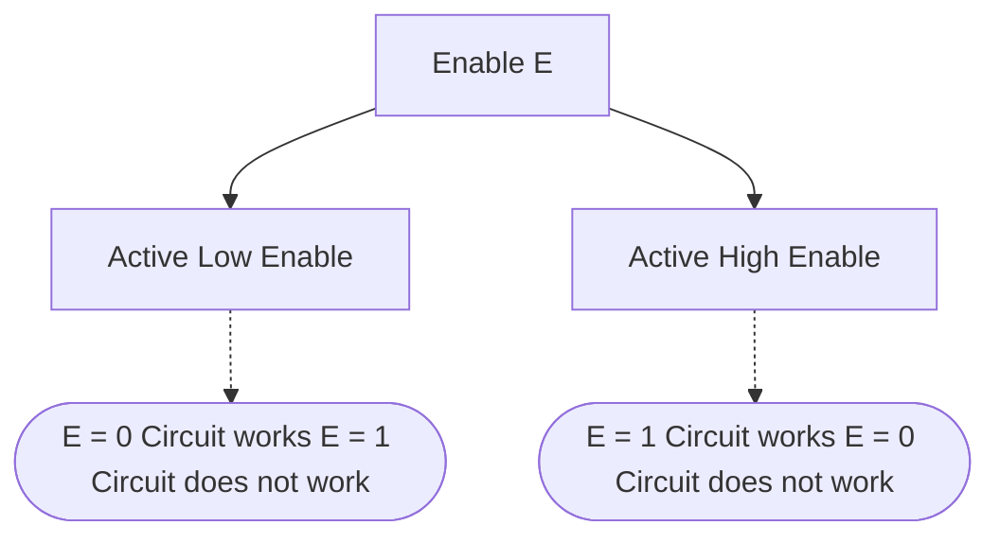

# Multiplexer

- Multiplexer (MUX) is a <mark style="background-color: #fff88f; color: black">data selector</mark>.
- Every MUX is a $2^n \times 1$ MUX, where $n$ is the number of select lines or control inputs and there are $2^n$ number of data input lines and $1$ output line.
- It is a combinational circuit which selects one of the $2^n$ data inputs are transmits the information to the output line.

> [!analogy] 
>> Think of MUX as a bridge where inputs are waiting at each gates and the control inputs check the ID number for each gateway. At a time, only one input can cross the bridge.
>
> ![[Multiplexer-20240303072621253.webp|$4 \times 1$ MUX Block Diagram]]
> 
>> The numbers on the inside of the block is matched against the control input lines.

The output line is dependent on the data input and the output control lines i.e. $f(S_{0}, S_{1}, I_{0}, I_{1}, I_{2}, I_{3})$.

| ![[Multiplexer-20240303073303413.webp]] | ![[Multiplexer-20240303073355096.webp]] |
| --------------------------------------- | --------------------------------------- |
| ![[Multiplexer-20240303073425779.webp]] | ![[Multiplexer-20240303073450940.webp]] |

## $2 \times 1$ MUX

| Graphical symbol for a $2 \times 1$ MUX                   | Circuit Diagram for $2 \times 1$ MUX                      |
| --------------------------------------------------------- | --------------------------------------------------------- |
| ![[Multiplexer and Demultiplexer-20240604100052176.webp]] | ![[Multiplexer and Demultiplexer-20240604102651924.webp]] |

![[Multiplexer and Demultiplexer-20240604101632997.webp]]
![[Multiplexer and Demultiplexer-20240604102515658.webp]]

| $s = 0$                                                   | $s = 1$                                                   |
| --------------------------------------------------------- | --------------------------------------------------------- |
| ![[Multiplexer and Demultiplexer-20240624181202757.webp]] | ![[Multiplexer and Demultiplexer-20240624181211860.webp]] |

$2 \times 1$ MUX is a [[Functional Completeness|functionaly complete]] digital circuit i.e. any boolean function can be implemeneted using only $2 \times 1$ MUX.

## $4 \times 1$ MUX

![[Multiplexer and Demultiplexer-20240604103239707.webp]]
![[Multiplexer and Demultiplexer-20240604103255786.webp]]

The MUX circuit can be built from SOP expression.
![[Multiplexer and Demultiplexer-20240604105245907.webp]]

$4 \times 1$ MUX is a [[Functional Completeness|functionaly complete]] digital circuit i.e. any boolean function can be implemeneted using only $4 \times 1$ MUX.

## $2^n \times 1$ MUX

![[Multiplexer and Demultiplexer-20240604105520882.webp]]

The general equation for the output of the MUX with $n$ control inputs and $2^n$ data inputs is,
$$
F = \sum_{k=0}^{2^n - 1} \; m_{k} I_{k}
$$
where $m_{k}$ is the minterm of the $n$ control variables and $I_{k}$ is the corresponding data input.

A combination of MUX can be used to select data inputs.

![[Multiplexer and Demultiplexer-20240604110426241.webp]]

## Realization of functions from MUX

The output of a MUX is a realized function or the function that is implemented.

> [!pdf] mod-3/lec-02A-02B.pdf Pg. No. 67-90

Control inputs can also be fixed with either high or low inputs.

> [!example] 
> ![[Multiplexer and Demultiplexer-20240604114405635.webp]]
> 
> ![[Multiplexer and Demultiplexer-20240624182429910.webp]]

Control inputs can also pose as data inputs.

> [!example] 
> ![[Multiplexer and Demultiplexer-20240604114236980.webp]]
> ![[Multiplexer and Demultiplexer-20240604114137410.webp]]

## Implementing Boolean Functions using MUX

> [!tip] 
> 1. Look at the given function carefully and do not use new variables for the select lines which are not in the given function.
> 2. If you are not getting any idea, then create the canonical SOP of the given function from the standard truth table to get the compact truth table and simplify the expression to get the MUX circuit.

![[Multiplexer-20240303083438217.webp]]

![[Multiplexer and Demultiplexer-20240604141901657.webp]]

![[Multiplexer-20240303084158702.webp]]

![[Multiplexer-20240303084651501.webp]]

![[Multiplexer-20240303085009336.webp]]

![[Multiplexer and Demultiplexer-20240604141832407.webp]]

![[Multiplexer and Demultiplexer-20240604142402362.webp]]

> [!pdf] mod-3/lec-02C.pdf Pg. No. 03-39

An ideal MUX should use all the data input pins and should not add extra hardware e.g. $4 \times 1$ MUX for $a \oplus b$.

![[Multiplexer and Demultiplexer-20240604175654257.webp]]

[[Shannons Expansion Theorem#Decompose Function into Minterms|Decompose]] the given function with respect to chosen set of variables as control lines and apply the input combinations to get a compact truth table and implement the function using MUX.

![[Multiplexer and Demultiplexer-20240604201927855.webp]]

---
> [!header] Single $2^n \times 1$ MUX is enough for any $n$-variable function

To implement a function of $n$ variables without using additional hardwares, a single $2^n \times 1$ MUX is enough, where $n$ is the number of control inputs. 
The truth table can be built using the inputs combinations of the $n$ variables.

For the data input lines, 
1. Connect `1` to MUX input line which are minterms of the function.
2. Connect `0` to the remaining MUX input lines.

![[Multiplexer and Demultiplexer-20240605114519342.webp]]

![[Multiplexer and Demultiplexer-20240605124143514.webp]]

> [!header] Single $2^{n-1} \times 1$ MUX is <mark class="hltr-cyan">not enough</mark> for any $n$-variable function

We need an Invertor in this case as additional hardware.

> [!example] 
>> $f = a \oplus b$ which is a 2 variable function requires a $2^{2-1} \times 1$ MUX and an invertor. A single $2 \times 1$ MUX is not enough.
>
> ![[Multiplexer and Demultiplexer-20240605174411860.webp]]

There are some $n$ variable functions which can be implemented using $2^{n-1} \times 1$ MUX.

> [!example] 
>> $f(a, b) = a + b$ is a function with $2$ variables and a single $2^{2-1} \times 1$ MUX is enough to implement $f$ 
>
> ![[Multiplexer and Demultiplexer-20240624205018737.webp]]

Use most significant variables are the control lines in this case.

![[Multiplexer and Demultiplexer-20240605212132974.webp]]

> [!example] 
> ![[Multiplexer and Demultiplexer-20240605212428467.webp]]

> [!summary] 

- Not every 2 variable function can be implemented using single $2^{2-1} \times 1$ MUX without additional hardware.
- Some 2 variable function can be implemented using single $2^{2-1} \times 1$ MUX without additional hardware.

A function $f$ over $n$ variables can be implemented by,
1. a single $2^n \times 1$ MUX.
2. a single $2^{n-1} \times 1$ MUX + a single NOT gate.
3. a single $2^{n-2} \times 1$ MUX + additional hardware e.g. OR, AND, NOT gates.

---
## Building Bigger MUX from Smaller MUX

> [!think] 
> A circuit manufacturing company may not manufacture your required MUX, for example, a $64 \times 1$ MUX cannot be manufactured by a company that manufactures $4 \times 1$ MUX in a large scale.

A single $4 \times 1$ MUX can be built using three $2 \times 1$ MUX.

![[Multiplexer and Demultiplexer-20240605215408538.webp]]

A single $8 \times 1$ MUX can be built using seven $2 \times 1$ MUX.

![[Multiplexer and Demultiplexer-20240606084334257.webp]]

A single $8 \times 1$ MUX can be built using three $4 \times 1$ MUX.

![[Multiplexer and Demultiplexer-20240606092838906.webp]]

A single $16 \times 1$ MUX is built using five $4 \times 1$ MUX.

![[Multiplexer and Demultiplexer-20240606102214478.webp]]

The control inputs must be configured accordingly or else we may not get the desired output.

![[Multiplexer and Demultiplexer-20240606094514927.webp]]
![[Multiplexer and Demultiplexer-20240606094607152.webp]]

> [!info] 
> When constructing a bigger MUX using smaller MUX, it requires a lot of hardware than constructing the bigger MUX itself.

Multiplexers can also be used to build some other useful digital circuits

A $2 \times 2$ cross bar switch can be built using a single $2 \times 2$ MUX.

| $2 \times 2$ MUX implemented as $2 \times 2$ cross bar switch | Working of a $2 \times 2$ cross bar switch                |
| ------------------------------------------------------------- | --------------------------------------------------------- |
| ![[Multiplexer and Demultiplexer-20240606104925205.webp]]     | ![[Multiplexer and Demultiplexer-20240606105049266.webp]] |

## MUX with Enable Input

- Enable is like a switch to ON or OFF the MUX.

> [!analogy] 
> When laptop power button is OFF, no matter whatever keys you press on laptop, there is no response and no computation.
> When laptop power button is ON, laptop works normally.

![[Multiplexer and Demultiplexer-20240606125325000.webp]]

<u>Active High Enable</u>
- When the enable = 1, the MUX is ON i.e. MUX works normally.
- When the enable = 0, the MUX is OFF i.e. MUX is idle.

![[Multiplexer and Demultiplexer-20240606125356045.webp]]

<u>Active Low Enable</u>
- When the enable = 0, the MUX is ON i.e. MUX works normally.
- When the enable = 1, the MUX is OFF i.e. MUX is idle.

| Active Low Enable                                         | Active High Enable                                        |
| --------------------------------------------------------- | --------------------------------------------------------- |
| ![[Multiplexer and Demultiplexer-20240606130855618.webp]] | ![[Multiplexer and Demultiplexer-20240606131019763.webp]] |
| ![[Multiplexer and Demultiplexer-20240606130925707.webp]] | ![[Multiplexer and Demultiplexer-20240606131042979.webp]] |
| ![[Multiplexer and Demultiplexer-20240606131000442.webp]] | ![[Multiplexer and Demultiplexer-20240606131112396.webp]] |

When the circuit is idle, then the output of the circuit is `0`.

---
# Demultiplexer

- An output line is selected for the incoming data in the DEMUX.
- DEMUX is more like which output receives the incoming data. The incoming data can be either 0 or 1.

![[Multiplexer and Demultiplexer-20240606133338806.webp]]

A single $1 \times 2^n$ DEMUX has $n$ select lines, one data input line and $2^n$ output lines.

> [!NOTE]
> Data is received byte by byte  by a demux in a serial manner.
> 
> ![[Multiplexer and Demultiplexer-20240606133535354.webp]]

In a DEMUX, each output line can be considered as a separate function depending on input and the control lines.
The input data (incoming data) can be either 0 or 1.

> [!discussion] 
> ![[Multiplexer and Demultiplexer-20240303202450744.webp]]

## $1 \times 2$ DEMUX

![[Multiplexer and Demultiplexer-20240606134910961.webp]]
![[Multiplexer and Demultiplexer-20240606134953328.webp]]

> [!caution] 
> The input data $D$ can be either $0$ or $1$. Don't just put $1$ everywhere in place of $D$.

## $1 \times 4$ DEMUX

![[Multiplexer and Demultiplexer-20240606135645806.webp]]
![[Multiplexer and Demultiplexer-20240606135708273.webp]]
![[Multiplexer and Demultiplexer-20240606135935115.webp]]

For each output line, only for one input combination, it is set to the incoming data, others are set to $0$.

---