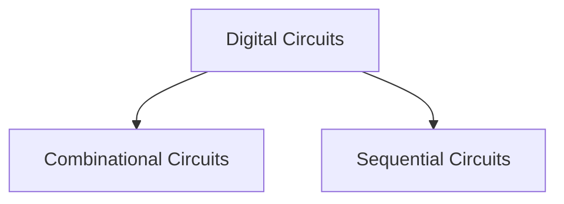

---
version:
  - DL-24
instructor: DeepakPoonia
tags:
  - GATE/Dashboard
  - DigitalLogic
---
# Digital Logic

- [[Digital-Logic-Mindmap.canvas|Digital-Logic-Mindmap]]
- [[Guidelines to GATE-CS#Guidelines to Digital Logic|Guidelines to Digital Logic]]

## Module 1 - Boolean Algebra, Minimization of Boolean Functions

- [[Introduction to Digital Logic]]
- [[Boolean Algebra]]
- [[Decimal and Binary System]]
- [[Laws of Boolean Algebra]]
- [[Boolean Function]]
- [[Algebraic Simplification of Boolean Functions]]
- [[Standard and Canonical Forms of Boolean Expressions]]
- [[Minimization using K Map]]
- [[Don't Cares in K Map]]
- [[Implicants in K Map]]

> [!youtube] 
> [Digital Logic: Standard Questions Session 1 - Boolean Algebra | GO Classes | Deepak Poonia - YouTube](https://www.youtube.com/watch?v=IvywHr5Oc00)

## Module 2 - Number Systems

- [[Number Systems]]
- [[Octal and Hexadecimal System]]
- [[Binary System]]
- [[Complements in Number System]]
- [[Subtraction of Unsigned Numbers]]
- [[Signed Binary Numbers]]
- [[Overflow of Signed and Unsigned Numbers]]
- [[Sign Extension of Unsigned and Signed Numbers]]
- [[Binary Codes for Decimal Digits]]
- [[Gray code]]

## Module 3 - Combinational Circuits

- [[Compact Truth Table Representation]]
- [[Shannons Expansion Theorem]]
- [[Multiplexer and Demultiplexer]]
- [[Encoder]]
- [[Decoder]]
- [[Propagation Delay and Timing Diagrams]]
- [[Half Adder and Full Adder]]
- [[Ripple Carry Adder]]
- [[Carry Look Ahead Adder]]
- [[Adder for Signed Addition]]

## Module 4 - Functional Completeness

> [!youtube] 
> [Digital Logic : Functional Completeness | Complete Playlist - YouTube](https://www.youtube.com/playlist?list=PLIPZ2_p3RNHh7tLVtGdh2mIRXJv8_Udnl)

- [[Functional Completeness]]
- [[Emil Post's Functional Completeness Theorem]]

## Module 5 - Sequential Circuits

| Output | State of the Digital Circuit |
| ------ | ---------------------------- |
| 0      | The circuit is reset (R)     |
| 1      | The circuit is set (S)       |

- [[Sequential Circuits]]
- [[Cross Coupled Inverters]]
- [[Cross Coupled NOR, NAND Gates]]
- [[Clock in Digital Circuits]]
- [[Flip Flop]]
- [[SR Flip Flop]]
- [[D Flip Flop]]
- [[JK Flip Flop]]
- [[T Flip Flop]]
- [[Flip Flop Conversion]]
- [[Preset and Clear Inputs]]
- [[Master Slave Flip Flops]]
- [[Race Condition on Flip Flop]]

> [!youtube] Timing Issues in Flip Flop
> [Digital Logic - Timing Issues, Constraints in Flip Flops | Clocking and Timing Analysis of Flip Flops | Hold Time, Setup Time | Sequential Circuits - YouTube](https://www.youtube.com/playlist?list=PLIPZ2_p3RNHi3p3cDBRInTHCJeITrkTFn)

- [[Timing Issues in Flip Flop]]

> [!youtube] Registers
> [Digital Logic - Registers in Sequential Circuits | Shift Register | Linear Feedback Shift Register | Universal Shift Register | PIOP, SISO, SIPO, PISO - YouTube](https://www.youtube.com/playlist?list=PLIPZ2_p3RNHj7EiWLYGUe0ULdZ6MRSLix)

- [[Registers]]
- [[Variations of Shift Register]]

> [!youtube] Finite State Machines
> [Digital Logic - Finite State Machines(FSM), Mealy, Moore Machines | Synchronous Sequential Circuits | GO Classes | GATE Overflow - YouTube](https://www.youtube.com/playlist?list=PLIPZ2_p3RNHjd6P9g6XoUm8E33CsUBqDv)

- [[Terminologies of Sequential Circuits]]
- [[Finite State Machine]]

- [[Counters]]
- [[Asynchronous Counters]]
- [[Synchronous Counters]]
- [[Ring and Johnson Counters]]

---
# Pending Lectures

![[Pending Lectures#Digital Logic]]

---
# Tests and Quizzes

> [!link] Weekly Quiz 30
> [GO Classes 2024 | Weekly Quiz 30 | Boolean Algebra, Minimization, Number System - GATE Overflow for GATE CSE](https://gateoverflow.in/exam/551/go-classes-2024-weekly-quiz-30-boolean-algebra-minimization-number-system)
> [Weekly Quiz 30 Solutions Part 1 - Boolean Algebra, Minimization, Number System | Digital Logic - YouTube](https://www.youtube.com/watch?v=EVHvvffg8Uc&feature=youtu.be&themeRefresh=1)

> [!link] Weekly Quiz 31
> [GO Classes 2024 | Weekly Quiz 31 | Multiplexer - GATE Overflow for GATE CSE](https://gateoverflow.in/exam/554/go-classes-2024-weekly-quiz-31-multiplexer)
> [Multiplexer - 15 GATE Previous Years Questions | GATE EC, EE, IN | Digital Logic | Weekly Quiz 31 - YouTube](https://www.youtube.com/watch?v=iH-tWF51Zbc)

---
# References

> [!youtube] 
> [Building an 8-bit breadboard computer! - YouTube](https://www.youtube.com/playlist?list=PLowKtXNTBypGqImE405J2565dvjafglHU)

> [!link] Alex Stoytchevs Lecture Notes
> [Alex Stoytchev's Classes and Seminars](https://www.ece.iastate.edu/~alexs/classes/)

---
