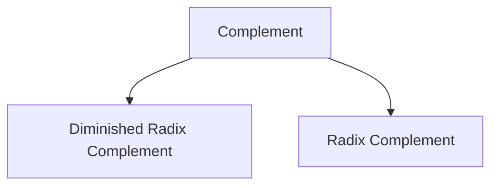

# Complements in Number System
Complementing is a operation on base-$r$ numbers.

If $n$ is the number of digits in the number $N$ in base $r$, then
- Diminished Radix Complement $= (r^n - 1) - N$
- Radix Complement $= r^n - N$
$$
((r^n - 1) - N) + 1 = r^n - N
$$
$$
\text{Diminished Radix Complement} + 1 = \text{Radix Complement}
$$

Complements are used in digital computers to simplify subtraction operation leading to simpler, less expensive circuits and logical manipulation.

> [!example] 
> ![[Complements in Number System-20240529100657224.webp]]
> ![[Complements in Number System-20240529100710677.webp]]
> ![[Complements in Number System-20240529100725195.webp]]

> [!trick] To find the $N$'s complement quickly
> 1. Go from right to left (LSP to MSP). 
> 2. Subtract the first non-zero number $x$ from $r$ i.e. $r - x$
> 3. and subtract the rest of the numbers $y_i$ from $(r - 1)$ i.e. $(r - 1) - y_i$ 

> [!example] 
> ![[Complements in Number System-20240529100921747.webp]]
> ![[Complements in Number System-20240529100943886.webp]]

![[Complements in Number System-20240529170613477.webp]]

![[Complements in Number System-20240529170704508.webp]]

> [!discussion] 
> ![[Complements in Number System-20240225093342933.webp]]

- The complement of the complement restores the number to its original value. This applies both for diminished radix and radix complement.

If the $r$'s complement of a number $N$ is $r^n - N$, then the complement of the complement is,
$$
r^n - (r^n - N) = N
$$

![[Complements in Number System-20240529094937031.webp]]

- If the number $N$ has a radix point, then it removed temporarily and computed the complement of $N$ and the radix point is added back in the complemented number in the same relative position.

> [!example] $N = 39.502$ 
> ![[Complements in Number System-20240530161201246.webp]]

---
