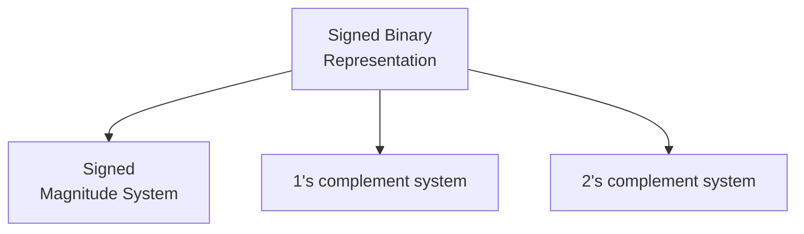

# Representations of Signed Binary Numbers

- There are three number systems for **signed binary** numbers.

- A computer can use any of the above three representations.
- These representations are **only** for binary numbers.
- Positive integers (including zero) can be represented as unsigned numbers. To represent negative integers, we need a notation for negative values.
- In computers, both signed and unsigned numbers consists of strings of 0s and 1s. The user determines whether the number is signed or unsigned.

## Signed Magnitude Representation
- If the Most significant bit is,
	- `1` then the number is negative and 
	- `0` then the number is positive 
- The Most Significant Bit is only a sign bit and rest of the bits are magnitude.
$$
+5 = \underbrace{0}_{\text{sign bit }}\underbrace{101}_{\text{ magnitude bits}}
$$
$$
-5 = \underbrace{1}_{\text{sign bit }}\underbrace{101}_{\text{ magnitude bits}}
$$

![[Signed Binary Numbers-20240225231026664.webp]]
- This representation is not very convenient on computers.
- The magnitude is a unsigned number.
- Signed Magnitude system is **NOT** a weighted system.

| $N_{10}$ | $+N$   | $-N$   |
| -------- | ------ | ------ |
| $0$      | $0000$ | $1000$ |
| $1$      | $0001$ | $1001$ |
| $5$      | $0101$ | $1101$ |

## 1's Complement Representation

- 1's complement system is a representation and not an operation.
- 1's complement system is **NOT** a weighted system.

> [!cases] $N \ge 0$
- If the number is non-negative, then the 1's complement system is similar to the signed magnitude system.

> [!cases] $N \lt 0$
- The MSB is `1`
- If the number is negative, then $N$ is stored as 1's complement of $+N$

- If the MSB is `1` in a given number $M$, then perform 1's complement on the number and if the resultant number is $N$, then $-N$ has been represented in this system as $M$. (This is in case of signed number representation.)

> [!example] 
> If $M = 1001$ (MSB = 1), then perform 1's complement operation on $M$
> $$
> \begin{split}
> M &= 1001 \\
> \tilde{M} &= 0110 = N \\
> -N &= -(0110) = M
> \end{split}
> $$
> $-6$ has been represented in the number $M$ (MSB = 1)

> [!attention] Silly Mistakes you can do
> -8 cannot be stored in 4 bits in 1s complement system
> ![[Signed Binary Numbers-20240530182112046.webp]]

## 2's Complement Representation

2's complement number system is a **weighted number system** i.e. with every position, some weight is associated. The Most significant bit (MSb) has a negative weight associated with it.
So in 2's complement system, every number has a unique representation.
$$
a_{n}a_{n-1}\cdots a_{2}a_{1}a_{0} = -2^n(a_{n}) + 2^{n-1}(a_{n-1})+\cdots +2^2(a_{2}) + 2^1(a_{1}) + 2^0(a_{0})
$$

In 2's complement system, the many number of leading 1's do not matter.

![[Signed Binary Numbers-20240530222623988.webp]]
![[Signed Binary Numbers-20240530222549478.webp]]

By default, 2's complement is considered in computers for signed numbers.

> [!cases] $N \ge 0$
- If the number is non-negative, then the 2's complement system is similar to the signed magnitude system.

> [!cases] $N \lt 0$
- The MSB is `1`
- If the number is negative, then $N$ is stored as 2's complement of $+N$

- If the MSB is `1` in a given number $M$, then perform 2's complement on the number and if the resultant number is $N$, then $-N$ has been represented in this system as $M$.

> [!example] 
> If $M = 1001$ (MSB = 1), then perform 2's complement operation on $M$
> $$
> \begin{split}
> M &= 1001 \\
> M^{\ast} &= 0111 = N \\
> -N &= -(0111) = M
> \end{split}
> $$
> $-7$ has been represented in the number $M$ (MSB = 1)

Since 2's complement representation is a weighted system, it can be expanded to convert directly to its equivalent decimal number with MS bit having a negative weight.

![[Signed Binary Numbers-20240612083106073.webp]]

> [!summary] 

- Sign-magnitude and 1s complement representation are non-weighted number systems.
- **Positive and unsigned numbers** are represented in the same way in all the three representations that are used in the computer systems.

![[Signed Binary Numbers-20240530215929110.webp]]

- Sign complement representation is not an operation, it is a system used to represent signed numbers in computer systems.

![[Signed Binary Numbers-20240530220128716.webp]]

- Sign complement representation is only for signed **binary numbers**. 

![[Signed Binary Numbers-20240530220354043.webp]]

---
# Range of Signed Binary Numbers

![[Signed Binary Numbers-20240531083621089.webp]]
There are 2 combinations for the same number $0$ in both signed magnitude and 1s complement system.

![[Signed Binary Numbers-20240531083754548.webp]]

Every number in 2's complement system has unique representation.

> [!help] 
> $2^n$ has $(n+1)$ bits
> 
> $2^n = 1\:\underbrace{0000}_{n} \quad$         i.e  $1$ followed by $n$ number of zeroes
> $2^{n}-1 = \underbrace{1111111}_{n} \quad$      i.e. $n$ number of $1$s
> 
> $2^{(n-1)} = 1\:\underbrace{00000}_{n-1} \quad$             i.e. $1$ followed by $(n-1)$ zeros
> $2^{(n-1)}-1 = \underbrace{1111111}_{n-1} \quad$                i.e. $(n-1)$ number of 1s

For a $n$ bit number, 

<u>Signed-Magnitude system:</u>
Minimum = $\underbrace{1}_{\text{negative sign bit }}\underbrace{1111\cdots 11}_{n-1 \text{ bits}} = - (2^{n-1} - 1)$ i.e. least negative value in $n-1$ bits.
Maximum = $\underbrace{0}_{\text{positive sign bit }}\underbrace{1111\cdots 11}_{n-1 \text{ bits}} = + (2^{n-1} - 1)$ i.e. most positive value in $n-1$ bits.

These $n-1$ bits are unsigned bits

<u>1's complement system:</u>
Minimum = $\underbrace{1}_{\text{negative sign bit }}\underbrace{0000\cdots 00}_{n-1 \text{ bits}} = - (2^{n-1} - 1)$ i.e. least negative value
Maximum = $\underbrace{0}_{\text{positive sign bit }}\underbrace{1111\cdots 11}_{n-1 \text{ bits}} = + (2^{n-1} - 1)$ i.e. most positive value

![[Signed Binary Numbers-20240531101555934.webp]]

<u>2s complement system:</u>
Minimum = $\underbrace{1}_{\text{negative sign bit }}\underbrace{0000\cdots 00}_{n-1 \text{ bits}} = - 2^{n-1}$ i.e. least negative value
Maximum = $\underbrace{0}_{\text{positive sign bit }}\underbrace{1111\cdots 11}_{n-1 \text{ bits}} = +(2^{n-1} - 1)$ i.e. most positive value

> [!summary] 
> ![[Signed Binary Numbers-20240531110043707.webp]]

![[Signed Binary Numbers-20240531110307480.webp]]
![[Signed Binary Numbers-20240531110322502.webp]]

---
# Arithmetic of Signed Binary Numbers
Computers don't know the difference between signed and unsigned numbers, which makes the logic circuits faster and also distinguishing between signed and unsigned numbers is our responsibility.

## Signed Magnitue System

The addition of two signed binary numbers follows the rules of ordinary arithmetic.

- The sign of the resultant will come from the number of larger magnitude.
- Just add the magnitude.
- If the sign bits are different, then subtraction has to be performed. 
- If the sign bits are same, then addition has to be performed.

Both the inputs and the outputs are both in signed magnitude system.

> [!example] 
> ![[Addition of Signed Binary Numbers-20240531184509116.webp]]
> ![[Addition of Signed Binary Numbers-20240531184406648.webp]]

The cost is too much in signed magnitude system as, 
- The sign bits has to be compared 
- The magnitude bits (n-1) has to be compared i.e. comparator circuit.
- If the signs are same, then adder circuit has to be used
- If the signs are different, then the subtractor circuit has to be used.
So, it is not used in computer systems.

> [!NOTE] 
> For addition, the signed-complement system does not require any comparison or subtraction. Hence they are used in computer systems.

## 1's Complement System

- The operand values and the resultant value are also in $1$'s complement representation.
$$
A - B = A + (-B) = A + (\text { 1's complement of } B \;)
$$
- Discard the carry over and add $1$ to the result.

> [!example] 
> ![[Arithmetic of Signed Binary Numbers-20240601083554951.webp]]
> ![[Arithmetic of Signed Binary Numbers-20240601083608292.webp]]
> ![[Arithmetic of Signed Binary Numbers-20240601083633480.webp]]
> ![[Arithmetic of Signed Binary Numbers-20240601083644905.webp]]

> [!NOTE] 
> In 1's complement addition, we are adding `1` to the result iff the final carry out is `1`.

## 2's Complement System

- The operands values and the resultant value are also in $2$'s complement representation.
![[Signed Binary Numbers-20240601105014048.webp]]
$$
A - B = A + (-B) = A + (\text { 2's complement of } B \;)
$$
- Discard the carry over of the signed bit position and the result is automatically in 2's complement representation.

> [!example] 
> ![[Arithmetic of Signed Binary Numbers-20240531195232273.webp]]
> ![[Arithmetic of Signed Binary Numbers-20240531222844535.webp]]
> ![[Arithmetic of Signed Binary Numbers-20240531223407961.webp]]

---
> [!summary] 

The binary signed numbers in the sign complement system are added and subtracted as the same way as unsigned numbers. Hence computer needs only one common hardware to deal with arithmetics of both types.

Addition of positive numbers in both 1's and 2's complement system are same.

2s complement system is better than 1s complement system because, 
- there is no additional addition by 1
- every number has unique representation
- range of the numbers is more.

For a number $(N)_{10}$ 
- $N$ + 2’s Complement of $N$ $= (0000 0000)_{2} = (0)_{10}$
- $N$ + 1’s Complement of $N$ $= (1111 1111)_{2} = (-0)_{10}$

---
