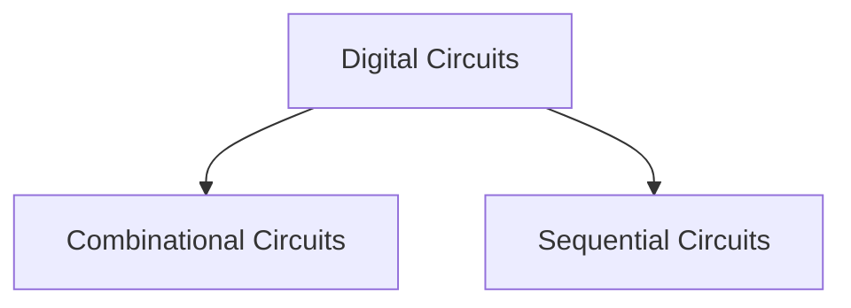

# Combinational Circuits vs Sequential Circuits



| Output | State of the Digital Circuit |
| ------ | ---------------------------- |
| 0      | The circuit is reset (R)     |
| 1      | The circuit is set (S)       |

## Combinational Circuits

- Consists only of logic gates.
- The outputs are determined only by the present value of input.
- Circuit behavior specified by a set of Boolean functions, Truth-tables, K-maps.
- *Examples*: Adder, Multiplexers, Encoders, Decoders.

![[Combinational Circuits vs Sequential Circuits-20240628225457529.webp]]

## Sequential Circuits

- Consists of logic gates and storage elements.
- Current output depends on the current input and previous output or all of the previous outputs.
$$
\begin{split}
\text{Current Output} &= f\,(\text{previous output or outputs}, \text{current input}) \\ \\
Y_{t} &= f (I_{t}, Y_{t - 1}) \\
Y_{t} &= f (\,I_{t}, (\,f(I_{t-1}, Y_{t-2})\,)\,) \\
&\vdots 
\end{split}
$$
where $Y_{t}$ is the output at time $t=0$ and $I_{0}$ is the input at time $t=0$.

![[Combinational Circuits vs Sequential Circuits-20240628225516969.webp]]

- The outputs are determined by present value of the inputs and the state of the storage elements.
- In sequential circuits, **state = output = stored data**.

> [!convention] 
> $Y =$ Current output
> $Y_{n} =$ next output 
> 
> $Q^+ = Q_n = Q_{t + 1} =$ Next state equation

### Memory Device

- Sequential circuits remember the history of outputs because of memory device or **memory element** which can store a single bit (0 or 1), which is the basic unit of memory storage.

> [!NOTE] 
> "*Remembering some information*" means storing and retaining data until it is further updated.


- In sequential circuits, synchronous means **in sync with clock** and asynchronous means **not in sync with clock**.

```merm
flowchart TD
A[Sequential Circuits] --> B[Synchronous]
A --> C[Asynchronous]
```

- Circuits with [[Flip Flop]] is a sequential circuit.
- The function of the sequential circuit is the next state equation $Q_n$
$$
Q_n = f\;(Q, I_0, I_1, \cdots, I_k)
$$


---