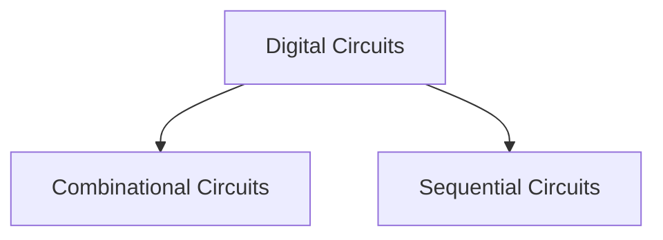

# Combinational Circuits vs Sequential Circuits



| Output | State of the Digital Circuit |
| ------ | ---------------------------- |
| 0      | The circuit is reset (R)     |
| 1      | The circuit is set (S)       |

## Combinational Circuits

- Consists only of logic gates.
- The outputs are determined only by the present value of input.
- Circuit behavior specified by a set of Boolean functions, Truth-tables, K-maps.
- *Examples*: Adder, Multiplexers, Encoders, Decoders.

![[Combinational Circuits vs Sequential Circuits-20240628225457529.webp]]

## Sequential Circuits

- Consists of logic gates and storage elements.
- Current output depends on the current input and previous output or all of the previous outputs.
- *Examples*: Flip Flops, Counters, Registers, Finite state machines.
$$
\begin{split}
\text{Current Output} &= f\,(\text{previous output or outputs}, \text{current input}) \\ \\
Y_{t} &= f (I_{t}, Y_{t - 1}) \\
Y_{t} &= f (\,I_{t}, (\,f(I_{t-1}, Y_{t-2})\,)\,) \\
&\vdots 
\end{split}
$$
where $Y_{t}$ is the output at time $t=0$ and $I_{0}$ is the input at time $t=0$.

> [!observation] 
> $Y$ is a **single output** line and outputs at different times are denoted by a subscipts e.g. $Y_{0}, Y_{1}, Y_{2}, \cdots$

![[Combinational Circuits vs Sequential Circuits-20240628225516969.webp]]

- The outputs are determined by present value of the inputs and the state of the storage elements.
- In sequential circuits, **state = output = stored data**.

> [!convention] 
> $Y =$ Current output
> $Y_{n} =$ next output 
> 
> $Q^+ = Q_n = Q_{t + 1} =$ Next state equation

- Sequential circuits remember the history of outputs because of [[Memory Device|memory device]] or **memory element** which can store a single bit (0 or 1), which is the basic unit of memory storage.
- A 1-bit memory is called a bi-stable, which has two internal states i.e. $0, 1$.

- Clock signals in sequential circuits are similar to the enable input in combinational circuits.
- In sequential circuits, **synchronous** means in sync with clock and **asynchronous** means not in sync with clock.

```merm
flowchart TD
A[Sequential Circuits] --> B[Synchronous]
A --> C[Asynchronous]
```

- Circuits with [[Flip Flop]] is a sequential circuit. If the flip flop is removed from a sequential circuit, then it is no longer a sequential circuit.
- Flip flops are 1-bit storage device.
- The function of the sequential circuit is the next state equation $Q_n$
$$
Q_n = f\;(Q, I_0, I_1, \cdots, I_k)
$$

> [!example] 
> ![[Combinational Circuits vs Sequential Circuits-20240702150235962.webp]]

### Terminologies of Sequential Circuits

**State of a Flip Flop :**

- The state or output of a flip flop is the data stored in the flip flop.
- A flip flop is a bi-stable device i.e. has two internal states.

![[Combinational Circuits vs Sequential Circuits-20240703105509640.webp]]

**State of a Sequential Circuit :**

- Circuits with [[Flip Flop]] are called sequential circuits.
- The output combination of the flip flops in a sequential circuit is called the state of the sequential circuit.

![[Terminologies of Sequential Circuits-20240312233622279.webp]]

- n flip flops have n-bits and $2^n$ possible states.


**State of a Register :**

- The state of the [[Registers|register]] is the data combination stored in the flip flops.
- The data stored in each flip flop will be available at each of its output.

![[Combinational Circuits vs Sequential Circuits-20240703121257748.webp]]

- The inputs waiting at the input line will be stored in the register after the clock trigger.

**State Table and Diagram :**

A state diagram is a graph that shows the flip-flop's operations in terms of how it transitions from one state to another. The nodes are labeled with the states and the directed arcs are labeled with the input signals that cause the transition to go from one state to the next.

State table is same as characteristic table.


**Next State Equation :**

- Present state means before clock trigger.
- Next state means after clock trigger.

![[Combinational Circuits vs Sequential Circuits-20240703120433675.webp|Present state and next state for a positive edge-triggered flip flop]]

> [!tip] 
> When writing next state equation from state diagram, focus on going to 1.

- Next state equation can be obtained from state table or state diagram.
- Using k-map, a minimized next state equation can be obtained.


> [!example] 

Given the state diagram of SR flip flop,

![[Combinational Circuits vs Sequential Circuits-20240703125800967.webp]]
$$
\begin{split}
Q_{n} (Q, S, R) 
&= \overline{Q} . S . \overline{R} + Q . \overline{S} . \overline{R} + Q . S . \overline{R} \\
&= (\overline{Q} . S . \overline{R} + Q . S . \overline{R})  + Q . \overline{S} . \overline{R} \\
&= S . \overline{R} + Q . \overline{S} . \overline{R}
\end{split}
$$
![[Combinational Circuits vs Sequential Circuits-20240703123210791.webp]]
$$
\begin{split}
Q_{\text{next}} (Q, S, R) 
&= \overline{S} . \overline{R} . Q + S . \overline{R} . \overline{Q} + S . \overline{R} . Q \\
&= \overline{S} . \overline{R} . Q + (S . \overline{R} . \overline{Q} + S . \overline{R} . Q) \\
&= \overline{S} . \overline{R} . Q + S . \overline{R}
\end{split}
$$

![[Combinational Circuits vs Sequential Circuits-20240703123855175.webp]]

---