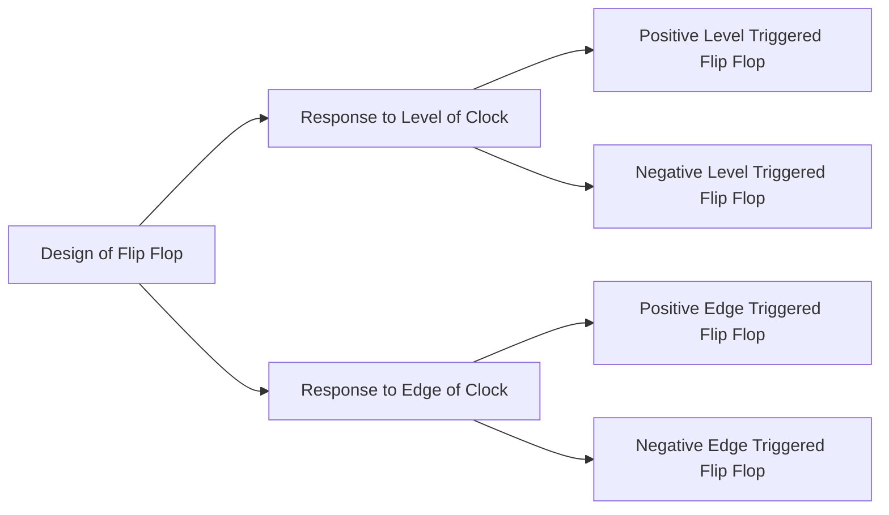

# Design of Flip Flops

> [!remember] 
> Clock is not level or edge triggered, but a flip flop is designed to be level or edge triggered.

## Implementation of Level-triggered Flip Flops

![[Flip Flop-20240702104111169.webp]]

![[Flip Flop-20240702104120958.webp]]

![[Flip Flop-20240702104134558.webp]]

![[Flip Flop-20240702104140892.webp]]

## Implementation of Edge Triggered Flip Flops

- There are many ways to implement edge triggered flip flop and Master Slave flip flops is one of them.

### Master Slave Flip Flop

- Master Slave Flip Flop is similar to Edge Triggered Flip Flop.

- The idea is to have two flip flops (one is master and the other is slave one) connected to the same clock.
- The master flip flop is positive level-triggered and the slave flip flop is negative level-triggered.

![[Master Slave Flip Flops-20240311172626301.webp|Block Diagram of Master Slave D Flip Flop]]

$$
\begin{split}
Q_{m} &= f\, (D, \text{ positive level of clock}) \\
Q_{s} &= f\, (Q_{m}, \text{ negative level of clock}) 
\end{split}
$$

Assume $Q_{m}$ and $Q_{s}$ are initially $1$,

![[Design of Flip Flops-20240702110436231.webp]]

Comparing the above waveform of $Q_{s}$ with the waveform $Q_{N}$ (assuming $Q_{N}$ is initially $1$) of a negative-edge triggered flip flop, it is clear that, the waveform of $Q_{s}$ behaves like it is triggered in response to the negative edge of the clock.

![[Design of Flip Flops-20240702110519644.webp]]

> [!intuition] 
> Why this Master Slave Flip Flop is behaving like Negative edge triggered Flip Flop?
> 
> ![[Master Slave Flip Flops-20240311183835013.webp]]

> [!important] 
> Master slave flip flop when used with enable inputs.
> 
> ![[Design of Flip Flops-20240702125041679.webp]]
> 
> This is still a negative-edge triggered flip flop, since master is a positive level-triggered flip flop and slave is a negative level-triggered flip flop.
> 
> - When clock = $1$, the master flip flop works and slave flip flop does not work.
> - When clock = $0$, the master flip flop does not work and slave flip flop works.

Similarly the positive edge-triggered master-slave D flip flop is built.

![[Design of Flip Flops-20240702113458675.webp]]

![[Master Slave Flip Flops-20240311172839371.webp]]

![[Master Slave Flip Flops-20240311172903054.webp]]

> [!header] Master Slave JK flip flop

![[Design of Flip Flops-20240702154350426.webp]]

![[Design of Flip Flops-20240702154126140.webp]]

> [!header] Master Slave T flip flop

![[Design of Flip Flops-20240702154332220.webp]]

---