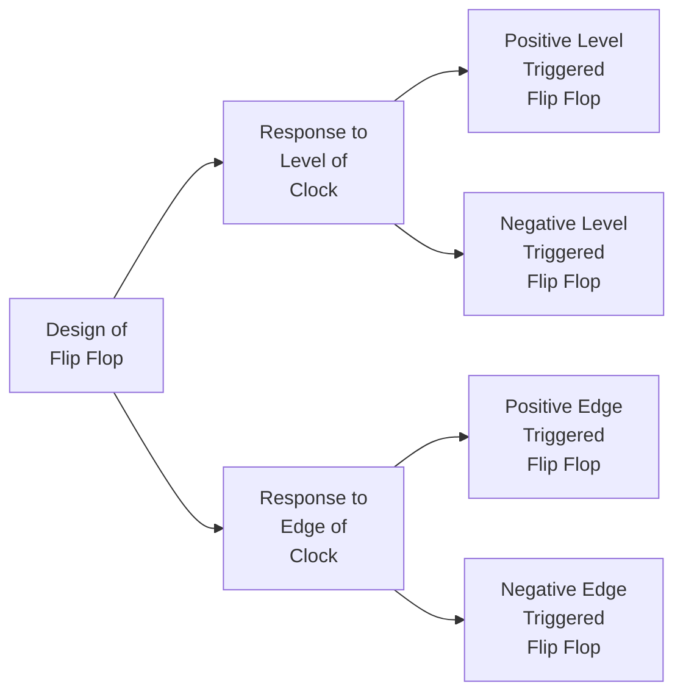

# Flip Flop

A flip flop is a latch controlled by clock.

- Clock Triggering is a property of flip flop and not a property of clock itself.
- For any flip flop, by default edge triggering is used. Because for one clock cycle (time period), the state changes only once.
- [[Clock in Digital Circuits|Clock]] is fixed for all flip flops.
- Don't consider clock as an input in the implementation equations of flip flops, because any flip flop can have any triggering.
- There are many ways to implement edge triggered flip flop and [[Master Slave Flip Flops]] is one of them.
- Characteristic equations of flip flops are derived from their characteristic tables or k-map of their truth tables.

There are 4 standard flip flops,
1. SR flip flop
2. D flip flop
3. JK flip flop
4. T flip flop

All flip flops are 1-bit storage devices.

> [!header] Edge Triggered Flip Flop

> [!remember] 
> A clock is not level or edge triggered, but a flip flop is level or edge triggered.

- Flip flops are mostly used as storage devices, hence [[Registers]]. Flip flops can also be used to implement frequency dividers, etc.., hence Counters.

# Summary of Flip Flop

![[Flip Flop-20240630234641703.webp]]
![[Flip Flop-20240630234702870.webp]]
![[Flip Flop-20240630234718641.webp]]
![[Flip Flop-20240630234751529.webp]]

---
