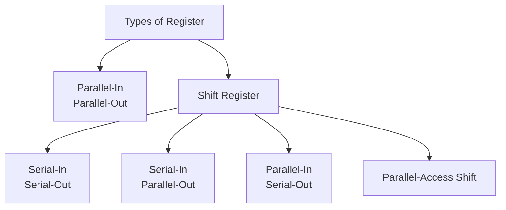

# Registers

> [!youtube] Registers
> [Digital Logic - Registers in Sequential Circuits | Shift Register | Linear Feedback Shift Register | Universal Shift Register | PIOP, SISO, SIPO, PISO - YouTube](https://www.youtube.com/playlist?list=PLIPZ2_p3RNHj7EiWLYGUe0ULdZ6MRSLix)

- A register is a group of [[Flip Flop|flip flops]] sharing a common clock, each of which is used to store a bit of data.
- All the flip flops in a register is synchronous to the clock.
- A n-bit register consists of n flip flops.
- A register may contain certain combinational gates that perform data-processing operations for the data stored in the flip flops.
- Clear input is used to clear or reset the data and Preset input is used to preset or set the data in the register.
- Registers are commonly used to **store** and **shift** (movement) binary data.
- Any flip flops can be used to construct registers, but [[D Flip Flop|D flip flop]] is most commonly used.

## Load Input

- To store data in D-flip flops, when the clock signal triggers the flip flop, the data gets stored i.e. $Q_{n} = D$.
- But since clock signal is common to every circuit in the system, when the clock signal triggers whatever data at the control lines will be stored, even if don't want to store a new data.

- To control *when to store the data*, we use load signal or load input in the register 
	- If the load = 0, the stored data should not be changed or data must be retained i.e. $Q_n= Q$
	- If the load = 1, the data should be stored i.e. $Q_n = \text{In}$

- All the flip flops in the register share the same load input.
- The load inputs are connected to each flip flip via a MUX rather than gating it with the clock which causes timing issues in flip flop.

![[Registers-20240702220339396.webp|1-bit parallel access register with load input]]

# Types of Registers

> [!tip] 
> There won't be any questions to create registers, but a register will be given and asked to analyze.

Based on how data is moving within or between registers, registers are classified into different types.

![[Registers-20240702205621061.webp|Basic data movement in 4 bit registers]]

## Parallel-In Parallel-Out Register

![[Registers-20240702220125334.webp|Vector notation of PIPO register]]

- $4$ in the vector notation means there are $4$.

![[Registers-20240702182742454.webp]]

When the clock edge arrives, the input word $D_{1}D_{2}D_{3}D_{4}$ gets stored in the register and available on the outputs $Q_{1}Q_{2}Q_{3}Q_{4}$.

![[Registers-20240702212819428.webp|4-bit PIPO register with load, preset and clear inputs]]

## Shift Register
- A shift register is a register in which data can be stored and this data can be shifted to left or right when a shift signal is applied.
- On the triggering edge, shifting occurs in every flip flop in the register.

- Depending upon the way the various stages are connected, there can be different variations of shift register.
	1. Ring Counter
	2. Twisted Ring or Johnson Counter
	3. Bidirectional Shift Register
	4. Universal Shift Register
	5. Linear feedback Shift Register

### Serial-In Serial-Out Shift Register

![[Registers-20240702220949810.webp|4-bit Serial-In Serial-Out Shift register]]

> [!header] Implementing using D flip flops

![[Registers-20240702221528121.webp]]

![[Registers-20240702221542453.webp]]

> [!header] Timing diagram of SISO shift register

![[Registers-20240702224301853.webp]]

### Serial-In Parallel-Out Shift Register

![[Registers-20240702223405929.webp]]

On the raising edge of the clock, the data available in the input line is stored in the D flip flops and available at the outputs lines parallely.

> [!NOTE]
> Data bits enters the flip flop from the least significant bit of the data.

![[Registers-20240702224821013.webp|The register contains 0110 after 4 clock pulses]]

### Parallel-In Serial-Out Shift Register

![[Registers-20240702231119920.webp]]

PISO register uses $\overline{S} \, L$ input i.e. $\overline{\text{shift}} \text{ / load}$ input.

- If $\overline{S} \, L = 0$, then shift the data to right.
- If $\overline{S} \, L = 1$, then loads the data into the register.

![[Registers-20240703102152323.webp]]

### Parallel-Access Shift Register

This register has parallel-in, parallel-out and serial-in, serial-out.

PASR uses $\overline{S} \, L$ input i.e. $\overline{\text{shift}} \text{ / load}$ input.

- If $\overline{S} \, L = 0$, then SISO.
- If $\overline{S} \, L = 1$, then PIPO.

![[Registers-20240702235349696.webp|A 4-bit Parallel-Access Shift Register]]

![[Registers-20240702235527065.webp]]

![[Registers-20240702235532518.webp]]

### UniDirectional Shift Register

These two shift registers are Serial-In Serial-Out shift registers.

![[Variations of Shift Register-20240703074720170.webp]]
![[Variations of Shift Register-20240703074145984.webp]]

### BiDirectional Shift Register

Based on a control input, the bidirectional shift register works either in shift-right or shift-left modes.

$L, \overline{R}$ line is used as a common control line of MUX's connected to each of the flip flop to determine whether to shift left or shift right.

- $L, \overline{R} = 0$, then right shift
- $L, \overline{R} = 1$, then left shift

![[Variations of Shift Register-20240703081834128.webp|4-bit Bi-directional shift register]]

### Universal Shift Register

Universal shift register has both left and right shifts and parallel-load capabilities.

![[Variations of Shift Register-20240703085923739.webp|Block diagram for 4-bit Universal Shift Register]]

The most general shift register has the following capabilities,

1. A clear control to clear the register to 0.
2. A clock input to synchronize the operations.
3. A shift-right control to enable the shift-right operation and the serial input and output lines associated with the shift right.
4. A shift-left control to enable the shift-left operation and the serial input and output lines associated with the shift left.
5. A parallel-load control to enable a parallel transfer and the n input lines associated with the parallel transfer.
6. n parallel output lines.
7. A control state that leaves the information in the register unchanged in response to the clock. 

![[Variations of Shift Register-20240703091336603.webp]]

![[Variations of Shift Register-20240703091455226.webp]]

### Linear Feedback Shift Register

- LFSR is a SISO right shift register where the serial input is generated as a linear combination (ExOR) of some of the flip flop outputs.

![[Variations of Shift Register-20240703093226084.webp]]

- In the above LFSR, after one clock pulse,
$$
\begin{split}
D_{1} &= Q_{1} \oplus Q_{4} \\
D_{2} &= Q_{1} \\
D_{3} &= Q_{2} \\
D_{4} &= Q_{3}
\end{split}
$$

- LFSR is used for random number or sequence generation.

![[Variations of Shift Register-20240703093701020.webp]]
![[Variations of Shift Register-20240703093707611.webp]]
![[Variations of Shift Register-20240703093717732.webp]]

![[Variations of Shift Register-20240703093742187.webp]]

- If we start with a random number within the range of the register, we end up getting a random sequence of numbers and get back the same number after some number number of shifts.
- LFSR are typically started with $1 000 \cdots 0$ pattern.
- In a LFSR of $n$ bit register, $2^n - 1$ distinct patterns are generated. All 0s pattern are avoided because when started with all 0s pattern, it never changes to another pattern. And also all 0s pattern never occurs in LFSR.

![[Variations of Shift Register-20240703093543735.webp]]

---
# Applications of Registers

- Some devices require serial data transmission and some devices require parallel data transmission, variations of shift registers help in serial-to-parallel and parallel-to-serial data conversions in data transmission.

![[Registers-20240703102710559.webp]]

- Shift registers can perform multiplication by power of 2 (left shift) and division by power of 2 (right shift).

- Random sequence can be generated by LFSR.

- An input pulse or a pulse train can be delayed by a finite number of clock periods using SISO register.

![[Registers-20240703102858366.webp|After 3 clock pulses, input data will be available at the output]]

![[Registers-20240703103834376.webp]]

- Data from one register can be copied to another register without losing data in the original register with the help of SISO register.

![[Registers-20240703103116356.webp|Contents of $R_{A}$ is copied to $R_P$ after 4 clock pulses]] 

A shift control can be used to control the occurence of shifting. It is gated with the clock (though it is problematic).

![[Registers-20240703103532707.webp]]
![[Registers-20240703103645746.webp]]

---