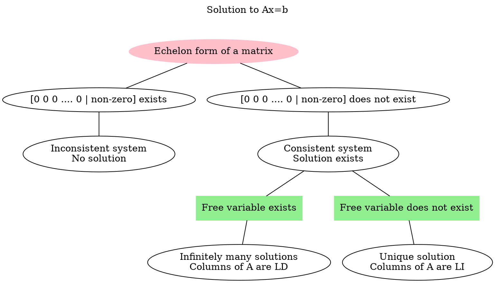

# Gaussian Elimination
Gaussian Elimination is an algorithm for solving system of linear equations.

```merm
flowchart LR
	A[Matrix] -- Gaussian Elimination --> B[Echelon Form of Matrix] 
```

## Row Echelon Form
- All non-zero rows are above any all-zero rows.
- All entries in a column below the leading entry of a row is zero.
- The leading entry of any row is always right to the leading entry of the row above it.

![[Gaussian Elimination-20240503174759345.webp]]

> [!example] 
> ![[Gaussian Elimination-20240503174537213.webp]]

Echelon form can be used to find out the rank of a matrix.

## Pivot and Free Variables
Each column in the matrix $A$ is associated with a variable in the vector $x$.

> [!example] 
> ![[Gaussian Elimination-20240502115815599.webp]]
>
> $x$ is associated with the column $a_1$ and $y$ is associated with the column $a_2$.

In Echelon form, the columns which have a leading non-zero entry is called a pivot column (base column) and the variable associated with the column is called the pivot variable or basic variable. The rest of the columns are free columns and the variable associated with the free columns are called free variables.


> [!example] 
> ![[Gaussian Elimination-20240503175359632.webp]]
> $x$ and $z$ are pivot variables
> $y$ and $t$ are free variables

Free column is always linearly dependant on pivot columns. If a matrix has a free column, then the column vectors form a LD set.

## Elementary Row Operations
These operations are performed on the rows of a matrix.

1. Swap the positions of two rows i.e. $R_i \leftrightarrow R_j$
2. Mutliply a row by a non-zero scalar i.e. $R_i \rightarrow c R_i\;, c \not= 0$
3. Add scalar multiple of another row to a row i.e. $R_i \rightarrow R_i + c R_j$

> [!caution] Dont's
>
>> [!tip] Operations which lead to loss of information of a row.
>>  $R_1 \rightarrow R_2$  (Loss of information of the row $R_1$. Interchanging is better in this case)
>>  $R_1 \rightarrow c_1 R_2 + c_2 R_3$ (Loss of information of the row $R_1$)
>
>> [!tip] Do not scalar multiply the left hand side row.
>>> This is generally applied when finding out determinants, it may not be avoided for finding out echelon form.
>>
>> $R_1 \rightarrow c_1 R_1 + c_2 R_2$ (This affects the value of the determinant)
>> $R_1 \rightarrow R_1 + c_2 R_2$ (This does not affect the value of the determinant)

## Rank of a Matrix

In echelon form of a matrix, rank is 
1. Number of linearly independent rows
2. Number of linearly independent columns
3. Number of pivot elements in echelon form
4. Number of non-zero rows in echelon form

> [!tip] 
> Rank of a matrix is 0 only for zero-matrix.
> Do not consider $b$ vector entry in the augmented matrix in rank nullity.

### Rank Nullity Theorem
Nullity is the number of free variables or columns.

If there are free variables in an echelon form of a matrix, then there are infinitely many solutions possible to the given system.

$$
\text{Total Number of columns} = \text{No of Pivot columns} + \text{No of free columns}
$$

```merm
flowchart TD
A[n columns in A] --> B[Rank r]
A --> C[Nullity n - r]
```

On reducing a matrix to echelon form, if there are no free variables i.e. only pivot columns, then the system has a unique solution.
If there are free variables, then assign a constant to the free variables.

## Solutions to Linear System

A linear system is consistent, if and only if an echelon form of a matrix has no row of the form $[0\;\cdots\; 0 \; b]$, where $b$ is non-zero.

If a linear system is consistent, then the solution set contains either 
1. Unique solution, where there are no free variables.
2. Infinitely many solutions, where there are at least one free variable.



In case of infinitely many solutions, the solution to the system is in parametric form and it consists of LI vectors. If there are $k$ free variables, then there are $k$ LI vectors. No. of independent solutions = nullity.

> [!NOTE] 
> Homogenous system can never be the inconsistent as the rightmost column of the augmented matrix is always filled with zeros i.e. $[0\;\cdots\; 0 \; b]$ never occurs in the augmented matrix of homogenous system.

> [!observation] 
> If a single linear equation has more than 2 unknowns, then there will be infinitely many solutions.
> ![[Gaussian Elimination-20240503222603929.webp]]

