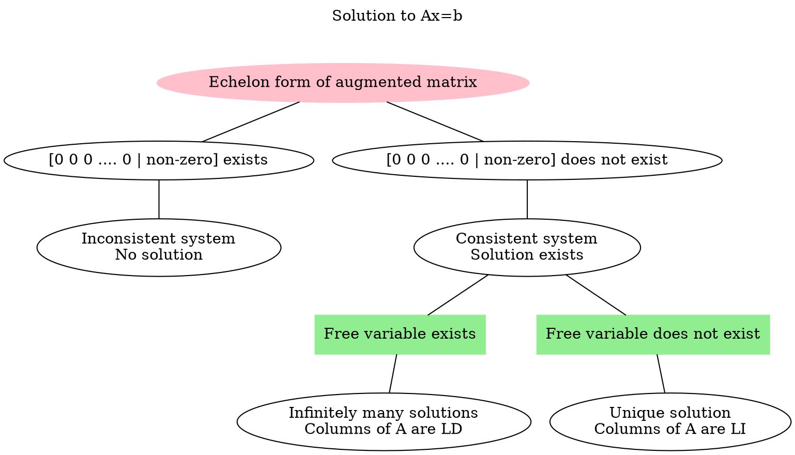
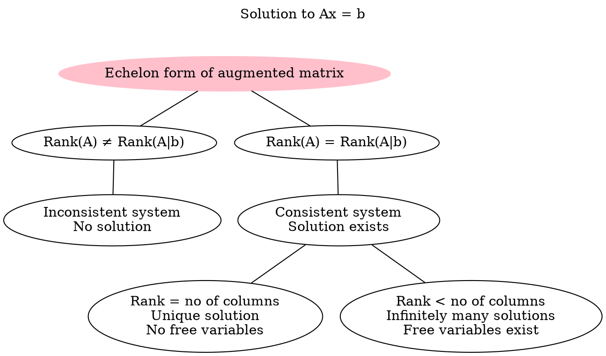

# Gaussian Elimination
Gaussian Elimination (or Row Reduction) is an algorithm for solving system of linear equations.

```merm
flowchart LR
	A[Matrix] -- Gaussian Elimination --> B[Echelon Form of Matrix] 
```

## Row Echelon Form
Every linear system is equivalent to a system whose augmented matrix is in row echelon form. Echelon form of a matrix is obtained after [[Gaussian Elimination#Elementary Row Operations|elementary row operations]].

Echelon form of a matrix has the following characteristics.
- All non-zero rows are above any all-zero rows.
- All entries in a column below the leading entry of a row is zero.
- The leading entry of any row is always right to the leading entry of the row above it.

![[Gaussian Elimination-20240503174759345.webp]]

> [!example] 
> ![[Gaussian Elimination-20240503174537213.webp]]

Echelon form can be used to find out the rank of a matrix.
A matrix can have more than one echelon form.

### Reduced Row Echelon Form
Reduced row echelon form has the following additional properties,
1. Each leading entry of a row is 1.
2. There are zeros above and below each leading 1.

![[Gaussian Elimination-20240504113324021.webp|Row echelon form to Reduced row echelon form]]

## Pivot and Free Variables
Each column in the matrix $A$ is associated with a variable in the vector $x$.

> [!example] 
> ![[Gaussian Elimination-20240502115815599.webp]]
>
> $x$ is associated with the column $a_1$ and $y$ is associated with the column $a_2$.

In Echelon form, the columns which have a leading non-zero entry is called a pivot column (base column) and the variable associated with the column is called the pivot variable or basic variable. The rest of the columns are free columns and the variable associated with the free columns are called free variables.

Pivots can never be 0's.

> [!example] 
> ![[Gaussian Elimination-20240503175359632.webp]]
> $x$ and $z$ are pivot variables
> $y$ and $t$ are free variables

Pivot columns in reduced row echelon form of a matrix of order $n$ are convenient vectors of $\mathbb{R}^n$.

Free column is always linearly dependant on pivot columns. If a matrix has a free column, then the column vectors form a LD set. 

> [!example] 
> ![[Gaussian Elimination-20240504115632272.webp]]

## Elementary Row Operations
These operations are performed on the rows of a matrix.

1. Swap the positions of two rows i.e. $R_i \leftrightarrow R_j$
2. Mutliply a row by a non-zero scalar i.e. $R_i \rightarrow c R_i\;, c \not= 0$
3. Add scalar multiple of another row to a row i.e. $R_i \rightarrow R_i + c R_j$

> [!caution] Dont's
>
>> [!tip] Operations which lead to loss of information of a row.
>>  $R_1 \rightarrow R_2$  (Loss of information of the row $R_1$. Interchanging is better in this case)
>>  $R_1 \rightarrow c_1 R_2 + c_2 R_3$ (Loss of information of the row $R_1$)
>
>> [!tip] Do not scalar multiply the left hand side row.
>>> This is generally applied when finding out determinants, it may not be avoided for finding out echelon form.
>>
>> $R_1 \rightarrow c_1 R_1 + c_2 R_2$ (This affects the value of the determinant)
>> $R_1 \rightarrow R_1 + c_2 R_2$ (This does not affect the value of the determinant)

Though elementary row operations are applied on a matrix, the matrix maintains its linear dependecy between its columns. Even after applying elementary row operations, number of LI columns is equal to number of LI rows.

## Rank of a Matrix

In echelon form of a matrix, rank is 
1. Number of linearly independent rows
2. Number of linearly independent columns
3. Number of pivot elements in echelon form
4. Number of non-zero rows in echelon form

> [!tip] 
> Rank of a matrix is 0 only for zero-matrix.
> Do not consider $b$ vector entry in the augmented matrix in rank nullity.

### Rank Nullity Theorem
Nullity is the number of free variables or columns.

If there are free variables in an echelon form of a matrix, then there are infinitely many solutions possible to the given system.

$$
\text{Total Number of columns} = \text{No of Pivot columns} + \text{No of free columns}
$$

```merm
flowchart TD
A[n columns in A] --> B[Rank r]
A --> C[Nullity n - r]
```

On reducing a matrix to echelon form, if there are no free variables i.e. only pivot columns, then the system has a unique solution.
If there are free variables, then the number of LI solutions is the number of free variables.

> [!NOTE] 
> Nullity = Dimension of Null Space

## Solutions to Linear System

A linear system is consistent, if and only if an echelon form of a matrix has no row of the form $[0\;\cdots\; 0 \; b]$, where $b$ is non-zero.

If a linear system is consistent, then the solution set contains either 
1. Unique solution, where there are no free variables.
2. Infinitely many solutions, where there are at least one free variable. 

> [!NOTE] 
> There are no 2 or 3 solutions to a system. If there is some non-trivial solution, then it means infinitely many solutions.
> There are only unique or infinitely many solutions.
> There is no unique non-trivial solution to homogenous system.



In case of infinitely many solutions, the solution to the system is in parametric form and it consists of LI vectors. If there are $k$ free variables, then there are $k$ LI vectors. No. of independent solutions = nullity.

> [!NOTE] 
> Homogenous system can never be the inconsistent as the rightmost column of the augmented matrix is always filled with zeros i.e. $[0\;\cdots\; 0 \; b]$ never occurs in the augmented matrix of homogenous system.

> [!observation] 
> If a single linear equation has greater than or equal to 2 unknowns, then there will be infinitely many solutions.
> ![[Gaussian Elimination-20240503222603929.webp]]

Non-homogenous system have a constant vector in their parametric form of the solution.
Non-homogenous system does not have a solution iff $[0\;\cdots\; 0 \; b]$ exist.

> [!header] Rank of matrix $A$ and augmented matrix $A \mid b$

If rank($A$) $\not=$ rank($A\mid b$), then $b$ is a pivot column and $[0\;\cdots \; 0 \; b]$ condition occurs. The vector $b$ is not a linear combination of columns of $A$, hence the system is inconsistent.

If rank($A$) $=$ rank($A\mid b$), then vector $b$ is a linear combination of columns of $A$, hence the system is consistent.

````col
```col-md
flexGrow=1
===
rank(A) $\not=$ rank(A | b)

![[Gaussian Elimination-20240504093644540.webp]]
The system is inconsistent and has no solution.
```
```col-md
flexGrow=1
===
rank(A) $=$ rank(A | b)

![[Gaussian Elimination-20240504093655143.webp]]
The system is consistent and has solutions.
```
````

![[Gaussian Elimination-20240504093415651.webp]]

If the last row has a leading entry i.e. pivot element in the last row, then the system always has a solution, regardless of the last entry.

![[Gaussian Elimination-20240504092723507.webp]]

> [!header] Rank of a matrix and no of columns

````col
```col-md
flexGrow=1
===
![[Gaussian Elimination-20240510095738278.webp]]
```
```col-md
flexGrow=1
===
If the rank$(A)$ = $n$ in the system $Ax = 0$ has only trivial solution, whether $m \gt n$ or $m = n$ or $m \lt n$.

All columns are pivot columns and there are no free variables.
```
````

````col
```col-md
flexGrow=1
===
![[Gaussian Elimination-20240510100414194.webp]]
```
```col-md
flexGrow=1
===
If rank($A$) = $m$ = $n$ in the system $Ax = b$, then all the columns are pivot columns and there are no free variables. 

The system has unique solution whether $b$ is a zero matrix or not.
```
````

````col
```col-md
flexGrow=1
===
![[Gaussian Elimination-20240510101134742.webp]]
```
```col-md
flexGrow=1
===
If rank($A$) = $n$ in the system $Ax = b$, then all the columns are pivot columns.

If $M$ is non-zero, then the system $Ax = b$ is inconsistent and has no solution.
If $M$ is zero, then the system is consistent and has unique solution, since there are no free variables.
```
````

````col
```col-md
flexGrow=1
===
![[Gaussian Elimination-20240510102359468.webp]]
```
```col-md
flexGrow=1
===
If rank($A$) = $m$ and $m \not= n$ in the system $Ax = b$, then $m \lt n$ and there are free columns.
This system cannot be inconsistent, since $[0\;0\; \cdots \;0\; \text{non-zero}]$ cannot occur here.
$m \not\gt n$, since rank of a matrix cannot be greater than no of columns.
```
````

Hence, the rank of a matrix can only be the lesser of the minimum of $m$ and $n$.
For a matrix $A_{m \times n}$, 
$$
\text{rank}(A) \le \text{min}(m, n)
$$
````col
```col-md
flexGrow=1
===
![[Gaussian Elimination-20240510103241379.webp]]
```
```col-md
flexGrow=1
===
If rank($A$) $\lt n$ and rank($A$) $\lt m$ in the system $Ax = b$, then there must be free columns and many all-zero rows.

If $M = 0$, then the system is consistent and has infinitely many solutions.

If $M$ is non-zero, then system is inconsistent and has no solutions. 
```
````
---


