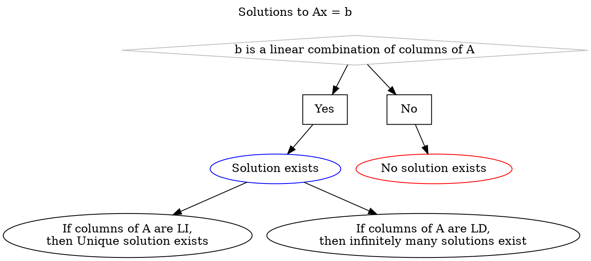

# System of Linear Equations

- A linear equation is an equation in which the highest degree of the equation is always one. There can any number of variables in a linear equation.

> [!example] 
> 
>> [!header] Linear Equation
> 1. $x - 3y = 5$
> 2. $2x + 4y = 10$
> 3. $3x + 5y = 14$
> 4. $4x - 3y = 1$
> 
>> [!header] Not a Linear Equation
> 1. $x^2 + y = 4$
> 2. $x^2 - xy = 0$ (Two variables must not be multipled)
> 3. $x - yz = 4$
> 4. $\sqrt{x} + y = 2$ ($n^{th}$ roots cause power of a variable to be $\frac{1}{n}$)
> 5. $x_1^2 + x_2^2 = 15$

- When more than one linear equations are put together, then it is a system of linear equations.
$$
\begin{align*}
x - 3y &= -5 \\
2x + 4y &= 12 \\
19y &= 1
\end{align*}
$$
- Solving the system of linear equations, helps us find out unknowns and variables.

There are two types of systems of linear equations,
1. Homogenous $Ax = 0$
2. Heterogenous $Ax = b$

---
## Geometric Interpretations and Possible Solutions

Consider a system of linear equations,
$$
\begin{align*}
x - 2y &= 1 \\
3x + 2y &= 11
\end{align*}
$$

The row picture of the system is,
![[System of Linear Equations-20240502080159448.webp]]

The column picture of the system is,
![[System of Linear Equations-20240502075940077.webp]]

> [!tip] 
> The column picture is the best when it comes to system of linear equations with more than 2 unknowns.

There are three cases of solutions for a system of linear equations $Ax = b$,
1. Unique Solution i.e. meet at a point
2. No Solution i.e. never intersect at any point, they run parallel
3. Infinitely many solutions i.e. collinear equations

---
## Understanding $Ax = B$

A system of linear equations can be rewritten in $Ax = B$ form.
![[System of Linear Equations-20240502080525983.webp]]

Consider the homogenous system from the above system $Ax = 0$,
$$
c_1a_1 + c_2a_2 + c_3a_3 = 0
$$
1. If the only solution is trivial to the homogenous system i.e $\forall c_i = 0$, then the columns of matrix $A$ are Linearly independent.
2. If the solution is non-trivial to the homogenous system i.e. $\exists c_i \not= 0$, then the columns of matrix $A$ are Linearly dependent.

Consider a matrix $A_{m \times n}$ which contains column vectors from vector space $\mathbb{R}^m$ and the system $Ax = b$ where b is either zero or non-zero vector i.e. any vector $b$
1. If $m \le n$, there is a matrix $A$ which gives solution to any $b$ i.e. matrix $A$ with $m$ or more LI vectors can bring solution to any vector $b$.
2. If $m \gt n$, there does not exist a matrix $A$ which gives solution to any $b$ i.e. Less than $m$ LI vectors cannot bring solution to any vector $b$.

> [!tip] 
> Solution to a system $Ax = b$ is the vector $x$.

$Ax$ is a linear combination of column vectors of the matrix $A$.

![[System of Linear Equations-20240503125631939.webp]]

If a vector $b$ is a linear combination of the column vectors of a matrix $A$, then solution definitely exists for the system $Ax = b$.

> [!tip] 
> If a vector $b$ is in the column space of $A$, then $b$ is the linear combination of column vectors of matrix $A$

> [!example] 
> ![[System of Linear Equations-20240503123845149.webp]]
> ![[System of Linear Equations-20240503123834098.webp]]
> ![[System of Linear Equations-20240503125601163.webp]]

Solving a system of linear equations have a lot of applications e.g. House price prediction, Image Classification etc...

