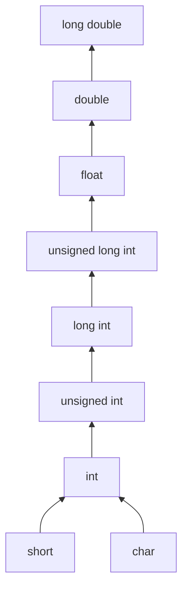

# Type Conversion in C



```ad-note
up the ladder = implicit conversion
down the ladder = explicit conversion
```

```ad-attention
**%f** specifier prints $0.000000$ when used to print an integer

![[Type Conversion in C-20240618103718583.webp]]
```

## Cases of Type Conversion

- Integer division in C truncates the precision

![[Type Conversion in C-20240618104610332.webp]]

---

- Integer division in C truncates precision, but when it is stored in a float, it adds the precision of 0s.

![[Type Conversion in C-20240618104930918.webp]]

- 'a' is explicitly type-casted to float, which also implicitly promotes 'b' to a float.
- floor division does not truncate precision.

![[Type Conversion in C-20240618105146524.webp]]

![[Type Conversion in C-20240618105257571.webp]]

---
- 'a' is integer and 'b' is float, hence no explicit type-casting to float is necessary to perform floor division.

![[Type Conversion in C-20240618105458803.webp]]

![[Type Conversion in C-20240618141507118.webp]]

---
- The precision gets truncated when stored in integer eventhough float division is performed.

![[Type Conversion in C-20240618143052028.webp]]

Similarly if an integer is to store a sum of float numbers, then the precisions are truncated to suit the integer.

![[Type Conversion in C-20240618143435177.webp]]

> [!attention] 
> `2.5 + 3.6 = 6.1`, the precision is truncated after the calculation as `6`, rather than individual operands of the operation `2.5` ,`3.6` getting truncated to `2` and `3` which leads to the result `2 + 3 = 5`.

---
```ad-info
Integer division (a/b) **never** generates precision even if it is going to be stored in float. 
If the result is stored in a float, the data-type float generates precision (0's).
```

- The float precision is truncated to integers as i and j are integers. float k captures the precision.

![[Type Conversion in C-20240618144308275.webp]]

---
- At LINE 7,  `a` is type-casted to int `10 / 8.2 = 1.219512` 

- At LINE 8, `a` and `b` both are type-casted to int `10 / 8 = 1.25` which gets truncated to `1` because of integer division and by storing in a float `d`, it becomes `1.00000`

- At LINE 9 `a` and `b` are not type-casted. `10.4 / 8.2 = 1.268293`

![[Type Conversion in C-20240618150029971.webp]]

---

![[Type Conversion in C-20240618151401702.webp]]

- At LINE 6, `x` is of 32 bits, so the type converted char has to be extended, but the source is now `unsigned char`, so zero extension occurs and `x` becomes 255 in 32 bits.

```ad-caution
When type-casting is performed, then it becomes casted type becomes the value's data type and extension happens based on the casted data-type as in `LINE 6`.
```

---
![[Type Conversion in C-20240618151942018.webp]]

In `LINE 8`, because of implicit conversion, `b` is type converted to `unsigned int`, because of `a` being a `unsigned int`. Hence $2^{32}-1 \gt 1000$.

---