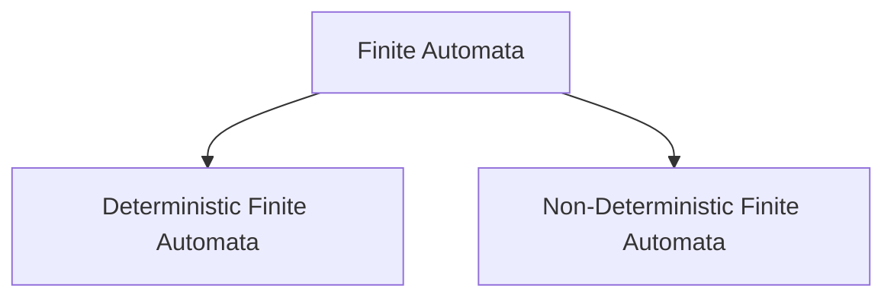

# Finite Automata

- Turing Machine with finite amount of space.

> [!question] What is a Finite Automaton?
> Finite Automaton is a set of states connected by transitions.

- Finite Automata is 5 tuple computational model.
	- Finite non-empty set of states ${} Q$
	- Initial State $q_0$ - only one state, not a set. $q_0 \in Q$
	- Input alphabet $\Sigma$ - non-empty finite set of symbols
	- Set of final or desired states $F \subseteq Q$. F can be $\phi$ 
	- Transition function $\delta : (Q \times \Sigma) \rightarrow Q$ 

- Final state is indicated by Double circles which are the desirable states.
- Initial state can also be the final or desirable state depending on the machine definition.
- States contain all the **possibilities** of the requirements for the language.

> [!example] Look at the examples in the PDF
> - Logic behind a light bulb
> - Logic behind a fan regulator
> - Logic behind a wall mart door
> - Recognise set of all even length strings

---
### Input Tape

- Contains the input string in forms of cells.
- Each cell has one alphabet symbol.
- The input tape is read from left to right one by one.
- The input tape for a null string $\epsilon {}$ is a single empty cell. 

![[Finite Automata-20231224155117842.webp]]

> [!brain] Null string $\epsilon$ is not a symbol

### Finite Control
- Contains all the setup (5 tuples) of the finite automata.

### Initial configuration
- Initial configuration or snapshot or situation is when the initial state reads the first symbol in the input string.

### String Acceptance
- String acceptance and language acceptance are different.
- All the accepted strings are collected under the set of the language of the automata.

### Transition Table

- This is the tabular representation of Transition function ${} \delta$
- Table of states VS alphabet symbols
- $\rightarrow$ is used to represent initial state
- $*$ is used to represent final states

### Language of the FA
- Language of the FA must contain ALL and ONLY strings that are accepted by the finite automaton A. It is denoted by ${} \mathscr{L}(A)$.
$$
\mathscr{L}(A) = \{ w \in \Sigma^* \; | \; A \text{ accepts } w \}
$$
> [!question] 
> What if there are NO final states?
- Since there is NO accepting state, NO strings will be accepted by the machine.
- The language of the machine ${} \mathscr{L}(A) = \phi$ 

### Two Problems in FA

````col
```col-md
flexGrow=1
===
1. When there is no definition for a transition function from a particular state for a given input symbol.
![[Finite Automata-20231224155805006.webp]]
```
```col-md
flexGrow=1
===
2. When there is a ambiguous definition for a transition function from a particular state for a given input symbol.
![[Finite Automata-20231224155839512.webp]]
```
````

- Because of the above two issues, there are two types of FA
	1. [[Deterministic Finite Automata]]
	2. [[Non-Deterministic Finite Automata]]



---