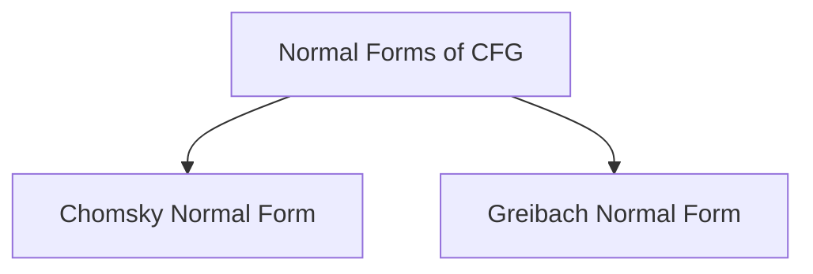

# Normal Forms of CFG

## Chomsky Normal Form
- CNF is ***not*** always unambiguous.
- A CFG in CNF can be ambiguous.

> [!conflict] CNF according to various authors because of empty string (which is really insignificant)

> [!header] Conversion of CFG to CNF
- Before proceeding to convert a CFG to CNF, the CFG has to be [[Simplification of Context Free Grammars|simplified]]
- Introduce variables for terminals.
- Introduce intermediate variables for reducing variables to two for each production rule.

> [!discussion] [Lecture 15C] Is this proof correct for no of nodes in CNF parse tree?
> ![[Normal Forms of Context Free Grammars-20240214182310827.webp]]

## Greibach Normal Form

