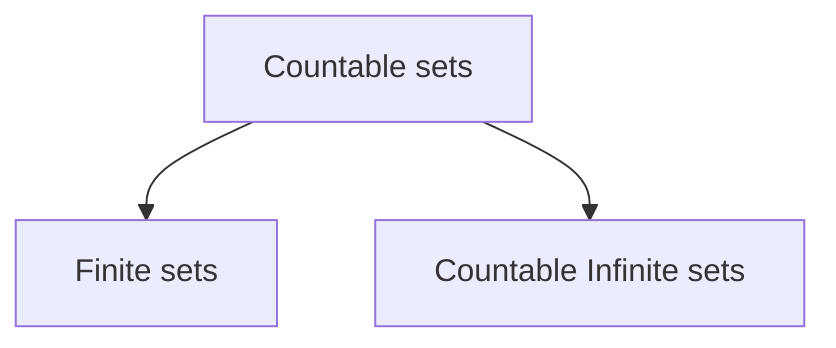

# Countable Sets

> [!definition] Countable Set
> A set $S$ is countable **iff** $S$ is either finite or $\mid S \mid\; = \;\mid \mathbb{N} \mid$
^countablesetsdef

## Definition #1
- For a infinite set $S$ to be countable, then there should exist a bijective function between $S$ and $\mathbb{N}$ i.e. $\mid S \mid \;=\; \mid \mathbb{N} \mid$
- $S$ is countable if there exists an injective function from $S$ to $\mathbb{N}$ i.e. $\mid S \mid \; \le \; \mid \mathbb{N} \mid$ 

> [!remember] Piecewise functions can also be defined when defining injection of a bijection.

- $\mid \mathbb{W} \mid \; = \; \mid \mathbb{N} \mid \;=\; \mid \mathbb{Z} \mid \; = \; \mid \mathbb{E} \mid$
- Countable infinite set is the lowest level of infinity.
- All countable infinite sets have the same size.

- If a set is countable infinite, then $\mid S \mid$ is denoted by aleph null ($\aleph_0$) i.e. $\mid S \mid = \aleph_0$
- There is no infinite set $S$ such that $\mid S \mid \; \lt \; \mid \mathbb{N} \mid$
- $S$ is finite iff $\mid S \mid \; \lt \; \mid \mathbb{N} \mid$

> [!note] 
> Finding a bijection is not easy.

---
## Definition #2
- A set $S$ is countable iff we can put the elements of $S$ in a sequence, indexed by **positive integers**.
- A set $S$ is countable iff there is a sequence in which every element of $S$ appears (at least once) at some finite position.

---
## Definition #3
- A set $S$ is countable iff to each element $n \in \mathbb{N}$, assign a finite subset of $S$, such that every element of $S$ is covered (at least once).

> [!NOTE] 
> Definition #3 is from a research paper and it is not found from standard books.

---